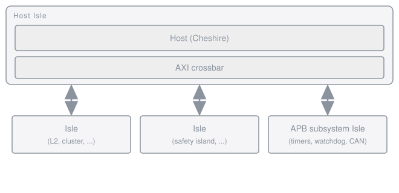
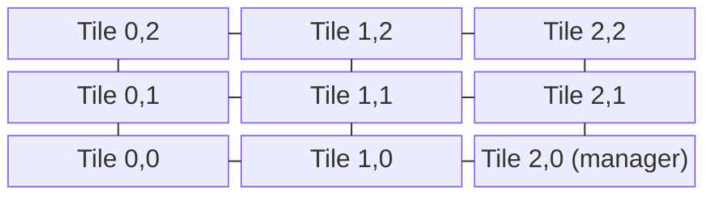
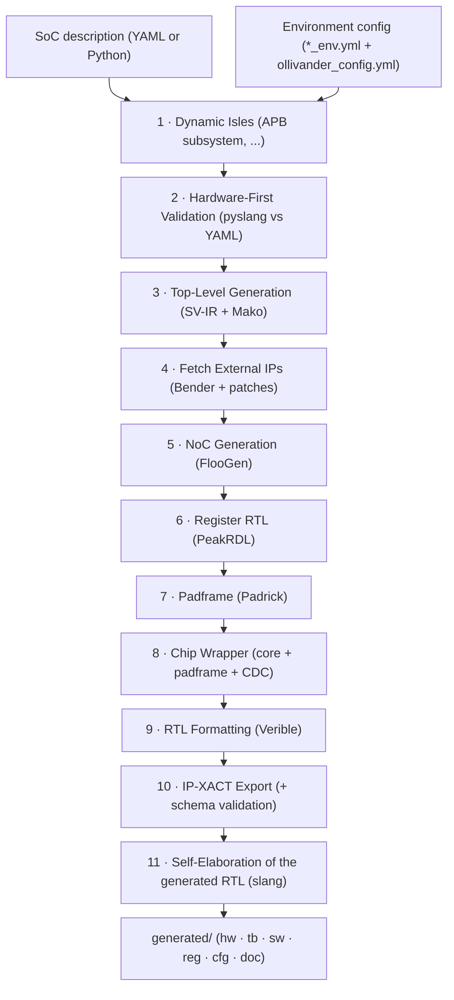

```
						     .                                              	 
						     *          .*..                                	
						   *. ..      .*    .                               	
						       *      .   ..                                	
						         *.   * ..*                                 	
						  	        *..*      ==**.                         	
    ____  _ _ _                      _  *....*   -#%*=                     
   / __ \| | (_)                    | |              :*%#-                  
  | |  | | | |___   ____ _ _ __   __| | ___ _ __        *%%%=                   
  | |  | | | | \ \ / / _` | '_ \ / _` |/ _ \ '__|         -*%@%%*=         
  | |__| | | | |\ V / (_| | | | | (_| |  __/ |                **%%%*=.          
   \____/|_|_|_| \_/ \__,_|_| |_|\__,_|\___|_|                  -=+*##**+.      
                                                                     -=#%%%#.    
  "Tricky customer, eh? Not to worry, we'll find                        =*#%#*=.    
   the perfect match here somewhere..."                                    =*##*=

                                                                  
```

# Ollivander SoC Generator

**Ollivander** is a highly automated, hardware-first, heterogeneous Multi-Core System-on-Chip (SoC) generator. It is designed to take a high-level YAML or native Python specification of an architecture and automatically generate the complete, synthesis-ready SystemVerilog top-level (or reusable Macro IPs), interconnects, clock/reset trees, and software register maps.

---

## 1. Core Philosophy

Ollivander bridges the gap between high-level architectural exploration and low-level physical implementation by enforcing two key paradigms:

### 1.1 The "Isle" Standardization (Unified Component Model)
In Ollivander, every hardware IP (whether it's a RISC-V host, a neural network accelerator, or a simple SPI controller) is encapsulated in a standardized SystemVerilog wrapper called an **Isle**. 
Isles abstract away IP-specific dialects, exposing only standardized interfaces (AXI4, RegBus, APB, JTAG, level-sensitive interrupts, and standard clock/reset pins). This allows the generator to stitch together incredibly complex, heterogeneous systems using a unified routing matrix without needing to "know" the internal details of any specific IP.

For Network-on-Chip topologies, this concept is extended to **Subtiles** (standard IPs automatically wrapped with NoC routers and chimneys) and **Tiles** (custom NoC nodes).

### 1.2 "Hardware-First" Validation
Ollivander refuses to generate broken RTL. Before generating the top-level SoC, it reads the physical SystemVerilog headers of your Isles and validates them against your YAML configuration. If you attempt to configure a 64-bit bus on an IP that strictly requires 32 bits, or map an interrupt to a pin that doesn't exist, Ollivander will halt and point out the architectural error before any code is generated.

---

## 2. Supported Topologies

Ollivander currently supports two major routing topologies:
*   **Crossbar**: Ideal for traditional embedded SoCs. The Manager (Host) encapsulates the central AXI routing matrix, exposing multidimensional arrays to the top-level where all other components connect.
*   **Network-on-Chip**: Fully supported for massively parallel, AI/ML accelerator arrays (e.g., FlooNoC). Maps logical coordinates to physical tiles on a 2D mesh, automatically instantiating routers, chimneys, and AXI joins.

**Crossbar topology** — the host isle owns the AXI crossbar, and every other isle attaches to it:



**NoC topology** — a FlooNoC 2D mesh; every tile holds a router, a chimney and its isle:



Either topology can also be exported as a reusable **macro** and instantiated as a component inside a parent SoC — of either topology, as the two `super_*` examples below exercise:


### Example Projects (`soc_cfg_examples/`)

Every example runs its firmware end-to-end in simulation — hello world on the small ones, the `offload` application (a strict superset: same greeting, then payloads dispatched onto every accelerator) wherever there are accelerators to drive — and the set doubles as the regression suite of the generator itself. Each project is deliberately the **only witness** of something, which is why none of them is redundant.

| Directory | Configuration | Topology | What it demonstrates |
| :--- | :--- | :--- | :--- |
| [`crossbar_mini`](soc_cfg_examples/crossbar_mini/) | `crux_mini.yml` | Crossbar | The minimum that boots: one host, one memory, no padframe. The UART debug boot |
| [`crossbar_micro`](soc_cfg_examples/crossbar_micro/) | `crux_micro.yml` | Crossbar | The same without a debugger: **autonomous boot** from an SPI flash, no preload |
| [`crossbar`](soc_cfg_examples/crossbar/) | `crux.yml` | Crossbar | Complete standalone SoC: clock tree, padframe, APB subsystem, heterogeneous isles |
| [`crossbar_isle`](soc_cfg_examples/crossbar_isle/) | `crux_isle.yml` | Crossbar | The same SoC exported as an **isle macro** with a unified AXI boundary |
| [`noc`](soc_cfg_examples/noc/) | `mesh.yml` | NoC | 2D mesh with multicast, booting on its own from an always-on scratchpad |
| [`noc_isle`](soc_cfg_examples/noc_isle/) | `mesh_isle.yml` | NoC | Mesh exported as an **isle macro**; boots from the **host's internal scratchpad** |
| [`noc_subtile`](soc_cfg_examples/noc_subtile/) | `mesh_subtile.yml` | NoC | Mesh exported as a **subtile macro**: native dual narrow/wide NoC boundary |
| [`super_crossbar`](soc_cfg_examples/super_crossbar/) | `super_crux.py` (Python) | Crossbar | Parent SoC nesting the **Mesh** macro — a NoC inside a crossbar |
| [`super_noc`](soc_cfg_examples/super_noc/) | `super_mesh.py` (Python) | NoC | Parent SoC nesting the **Crux** isle macro and a mesh subtile — a crossbar inside a NoC |

The two `super_*` projects deliberately cross the topologies, so each of them resolves, compiles and simulates the external IPs of **both** families in a single Bender dependency graph.

The set also spreads the **boot roads** so that every one of them has a witness: `force` (`crossbar_isle`, `noc_subtile`), the debug-module boot (`crossbar`, `noc`), the same composed with a serial-link image transport (`noc_isle`, `super_crossbar`), the self-sufficient serial-link boot that never touches the TAP (`super_noc`), the bootrom's own UART debug server (`crossbar_mini`), and the autonomous fetch from an external flash, where nothing drives the chip at all (`crossbar_micro`). Where the boot **image** lives is spread on purpose too — an always-on scratchpad, a gated L2 tile brought up by the testbench, the host's own internal scratchpad — because each of those exercises a different power-up dependency.

---

## 3. The Generation Flow

The generation engine (`ollivander.py`) combines Python and Mako templates in a rigorous 11-Phase pipeline:



### Phase 1: Dynamic Isles Generation
Ollivander reads the YAML configuration and generates intermediate SystemVerilog wrappers for composite blocks. For example, the `apb_subsystem` is built dynamically: Ollivander injects standard peripheral interrupts, generates the `AXI -> AXI-Lite -> APB` conversion pipeline, and instantiates the requested IP cores (Timers, Watchdogs, CAN, etc.) into a single, cohesive Isle.

### Phase 2: Hardware-First Validation
The generator cross-checks the user's YAML configuration against the actual physical parameters (`parameter`, `localparam`) and ports (`input`, `output`) defined in the SystemVerilog Isles. It verifies sync/async boundaries, parameter limits, and exact interrupt port names.

### Phase 3: Top-Level Code Generation
Ollivander builds a massive connection matrix and uses Mako templates to generate:
*   `<project_name>_soc_pkg.sv`: The SystemVerilog package containing the memory map and routing indices.
*   `<project_name>.sv`: The complete Top-Level SystemVerilog file, including glitch-free clock muxes, fractional dividers, reset synchronizers, and cross-domain crossing (CDC) logic for all interrupts.
*   `<project_name>_regs.rdl` & `<project_name>_memory_map.rdl`: The SystemRDL specifications for the central System Controller registers and the global SoC memory map.
*   `Bender.yml`: A complete compilation manifest auto-populated with external IP packages and linked local dependencies.

### Phase 4: Fetch External IPs & Pre-Build
Ollivander invokes **Bender** to fetch all the external IP repositories defined in the dependencies registry. Once downloaded, it executes any defined pre-build scripts or applies on-the-fly text patches to prepare the IPs for compilation.

### Phase 5: Network-on-Chip Generation (Optional)
If the NoC topology is selected, Ollivander invokes `floogen` to generate the NoC configuration, router instances, and standard FlooNoC packages based on the physical placement defined in the YAML.

### Phase 6: Register RTL Generation
Ollivander invokes **PeakRDL** to parse the generated SystemRDL files. This produces the synthesis-ready SystemVerilog for the System Controller (handling software resets, AXI isolation, and clock gating) and the C-header files (`.h`) for bare-metal software drivers.

### Phase 7: Padframe Generation (Optional)
If a padframe is defined, Ollivander delegates the physical I/O ring and pinmux generation to **Padrick**. Ollivander supports three options for defining the pad list: flat CSV files (`.csv`), dynamic Python generator scripts (`.py`), or native Padrick YAML files (`.yml`). It supports multiple power domains and generates the CSRs and the RTL for the complete pad ring. For more details, refer to the [Padframe Configuration Guide](docs/padframe_configuration_guide.md).

### Phase 8: Chip Wrapper Engine (Optional)
Ollivander parses the Core RTL and the Padrick-generated Padframe package, cross-validating the exact port struct signatures. It then safely renders the final `<project_name>_chip.sv` physical wrapper, instantiating the core, the padframe, and the necessary Clock Domain Crossing (CDC) adapters for the configuration bus.

### Phase 9: RTL Formatting
To ensure a clean, professional, and highly readable output, Ollivander invokes **Verible** to automatically format all generated SystemVerilog code according to strict formatting standards.

### Phase 10: IP-XACT Component Export
Ollivander generates a standard-compliant IEEE 1685-2014 IP-XACT XML component description for the digital top-level (excluding the padframe) under `<outdir>/hw/ipxact/<project_name>.xml`. It automatically performs schema validation via `pyEDAA.IPXACT` to ensure full compatibility with commercial and open-source EDA tools.

### Phase 11: Self-Elaboration of the Generated RTL
Ollivander re-reads what it has just written: the whole design is elaborated with **slang** (through `pyslang`, already a dependency), and any error inside the generated output or the component directories stops the generation. The dependencies are materialised by this point, so the real IPs elaborate and our wrappers are checked against their true signatures - no stubs involved. It catches the class no other flow can see, because `vlog` does not check port existence across a module boundary and no simulation ever elaborates the chip wrapper. Costs two to four seconds; governed by `generated_rtl_check` (`strict` by default, `warn`, `off`) in the environment configuration. The `fast-check` flow runs the same check a second time over its stubbed file list, which is what verifies that a stub faithfully represents the IP it replaces.

### Beyond Generation: Software Bridging & Testbench Preloading
To close the gap between hardware generation and bare-metal validation, Ollivander can fully automate the software build and simulation setup. If defined in your YAML, it will:
1. Generate a **Linker Script** (`linker.ld`) perfectly synchronized with your SoC's physical memory map, eliminating manual offset errors.
2. Create a starter **`main.c` firmware skeleton** that automatically includes the generated hardware CSR headers.
3. Compile the application into `.elf` and `.hex` binaries using the specified RISC-V toolchain.
4. Configure the auto-generated SystemVerilog testbench (`tb_<name>.sv`) to bring the SoC up and get that binary — `.hex` or the `.elf` itself — into memory before the host runs, by whichever road the project asks for: a hierarchical `$readmemh` into the physical SRAM instances (fast, simulation-only), or an **architected** transport that writes by address exactly as silicon would — the debug module's system bus, an off-chip serial-link twin, or the bootrom's own UART debug server. A project may also let the chip fetch its own image from an external flash or EEPROM, in which case the testbench only preloads that device and waits.

---

## 4. Key Automated Features

*   **Configuration-as-Code (Python)**: Alongside YAML, define massive, highly-parameterized SoC topologies programmatically using native Python scripts and Pydantic models. Perfect for algorithmic NoC cluster placement and Address Map computations.
*   **Standalone vs Macro Build Modes**: Generate a complete, standalone Chip (including physical padframes and physical I/O) or export your architecture as a reusable **Macro IP**. Macros expose standard AXI boundaries, allowing you to easily instantiate complex Ollivander subsystems inside larger Parent SoCs.
*   **Intelligent Clock & Reset Trees**: Automatically generates software-controllable glitch-free muxes and integer dividers for every defined clock domain, complete with 4-phase CDC handshakes for the configuration registers.
*   **Automatic CDC for Interrupts**: Analyzes the clock domains of interrupt sources and destinations. If they differ, it automatically injects multi-stage synchronizers or edge-to-level propagators.
*   **Automated Dependency Management**: Ollivander actively parses your SystemVerilog files and Mako templates to extract `// BENDER:` and `// OLLIVANDER:` dependencies, automatically building a precise `Bender.yml` manifest that links standard IP libraries and local infrastructure files without duplicating code.
*   **Implicit Interrupt Routing**: You only need to define the interrupt *destination* in the YAML (e.g., `manager` listens to `ethernet.rx_irq`). Ollivander automatically infers the output port on the source component and wires them together.
*   **Decoupled Register Specifications**: Third-party IP registers are discovered dynamically via the `// PEAKRDL: source="..." map="..."` pragma inside their SystemVerilog wrappers, allowing Ollivander to automatically build a unified global C-header for the software stack.
*   **AXI Isolation**: Heterogeneous SoCs require IPs to be powered down or reset independently. Ollivander automatically generates AXI isolation fences controlled by the central System Controller to prevent bus deadlocks.
*   **Hardware-to-Software Synchronization**: Linker scripts and C-headers are dynamically generated directly from the hardware specification, guaranteeing that your bare-metal software always targets the correct memory map and peripheral base addresses.
*   **Physical Chip Wrapping**: Fully automates the tedious and error-prone process of instantiating hundreds of physical I/O pads and routing them to the internal SoC logic (supporting CSV, Python, and native YAML inputs; see [Padframe Configuration Guide](docs/padframe_configuration_guide.md)).
*   **IEEE 1685-2014 IP-XACT Generation**: Automatically exports standard-compliant XML component metadata descriptions for the digital core top-level, grouping ports into standard logical interfaces (clocks, resets, AXI4) and setting up view instantiations for seamless EDA tool integration.
*   **NoC Design Rule Checking & Latency Reports**: Includes a built-in NoC Placement Checker (NPC) that validates manual tile coordinates, detects physical collision/overlap conflicts, and generates a latency/routing report with the Manhattan hop-count matrix.

---

## 5. Usage

Ollivander provides a fully automated `Makefile` workflow powered by a shared config file (`ollivander.mk`). To start a new project:

1. **Prepare YAML Configurations**: Create your SoC architectural specification YAML (e.g., `my_project.yaml`) and your environment bridge YAML (e.g., `my_project_env.yaml`). You can find examples in the `soc_cfg_examples/` directory.

2. **Create the Project Makefile**: Create a file named `Makefile` in the root of your project directory, defining your project configuration variables and including the shared `ollivander.mk`:
```makefile
# Path to the root of the Ollivander repository/submodule
OLLIVANDER_ROOT := .
SOC_YAML        := my_project.yaml
ENV_YAML        := my_project_env.yaml
OUT_DIR         := generated

include $(OLLIVANDER_ROOT)/ollivander.mk
```

3. **Setup the Environment**: Install dependencies and tools (it automatically uses `uv` if available, or falls back to `pip`):
```bash
make setup
```

4. **Generate the SoC**: Run the generator using the `make` target:
```bash
make generate
```

5. **Simulate**: You can compile the generated hardware and run the simulation using QuestaSim:
```bash
make build-sim
make run-sim
```

6. **Fast-Check (Structural Validation)**: For rapid structural validation during iterative development, compile and lint the generated SoC using stubbed external dependencies:
```bash
make fast-check
```
*Note: You can select the backend simulator (QuestaSim or Verilator) in your environment configuration YAML file via `fast_check_tool`, or temporarily override it at command-line (e.g., `make fast-check FAST_CHECK_TOOL=verilator`).*

The output will be cleanly organized into subdirectories inside `<outdir>` (e.g., `generated/` or the path specified by `-o`):

```text
<outdir>/
├── <sub_hw>/                     # Hardware RTL (*.sv)
│   ├── <project_name>.sv
│   ├── <project_name>_chip.sv    # The final physical chip wrapper (if padframe is used)
│   ├── <project_name>_soc_pkg.sv
│   ├── padframe/                 # Auto-generated RTL and packages from Padrick
│   ├── ipxact/                   # Auto-generated IEEE 1685-2014 IP-XACT XML Component Description
│   │   └── <project_name>.xml
│   └── ...
├── <sub_sw>/                     # Software bridging artifacts:
│   ├── <project_name>_soc_regs.h # Auto-generated C-headers for bare-metal CSR access
│   ├── linker.ld                 # Memory-mapped Linker Script
│   ├── main.c                    # Starter C firmware skeleton
│   └── *.elf, *.hex              # Compiled software binaries ready for simulation
├── <sub_reg>/                    # Register specification files (*.rdl)
├── <sub_tb>/                     # Auto-generated SystemVerilog testbench with memory preloading (*.sv)
├── <sub_cfg>/                    # Generated configuration files for tools like FlooGen (*.yml)
├── <sub_doc>/                    # Output documentation and mapping tables (*.csv)
└── sim/sim.mk                   # Auto-generated simulation targets (QuestaSim, Verilator)

<bender_manifest>                 # Main compilation manifest linking external IPs and generated RTL
```

---

## 6. Directory Structure

*   `ollivander.mk`: Shared Makefile containing the central build rules and setup routines.
*   `ollivander_config.yml`: Environment configuration and centralized dependency registry.
*   `src/`: The core engine, containing the Python scripts (`ollivander.py`, `soc_schema.py`, `wiring.py`) and the `templates/` folder (Mako blueprints for SystemVerilog and C).
*   `soc_cfg_examples/`: Contains example YAML configurations (the "Single Source of Truth" for the SoC).
*   `components/isles/`: Standardized SystemVerilog wrappers (and their Mako templates if dynamically generated) for the hardware IPs.
*   `components/tiles/`: Specialized wrappers for Network-on-Chip (NoC) topologies, automatically instantiating routers and network adapters.
*   `components/infrastructure/`: The Hardware Abstraction Layer (HAL) containing simulation-ready physical primitives (glitch-free clock muxes, integer dividers, reset generators, CDCs, and edge-to-level propagators) intended to be mapped to technology-specific standard cells during ASIC/FPGA synthesis.
*   `docs/`: Official documentation, tutorials, and configuration guides.

---

## 7. Documentation

The [documentation portal](docs/README.md) organizes every guide by reading path. The three entry points:

| If you want to... | Start from |
| :--- | :--- |
| **Use** Ollivander to build an SoC | [Getting Started](docs/getting_started.md), then the [SoC](docs/soc_configuration_guide.md), [Environment](docs/env_configuration_guide.md) and [Padframe](docs/padframe_configuration_guide.md) configuration guides |
| **Wrap an IP** so the generator can instantiate it | The [component standardization contract](docs/hw/component_standardization.md), plus [Clocking, Reset & CDC](docs/hw/clocking_reset_cdc_requirements.md) |
| **Develop** Ollivander itself | The [SV-IR architecture](docs/developer/intermediate_representation.md), the [universal tile template](docs/developer/universal_tile.md) that wraps every isle into a NoC tile, and the planned work in [`docs/developer/wip/`](docs/developer/wip/future_evolution_tasks.md) |
