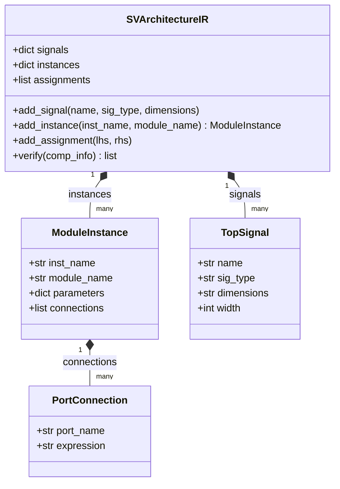

# SystemVerilog Architecture Intermediate Representation (SV-IR)

Ollivander uses a structured, object-oriented SystemVerilog Intermediate Representation (SV-IR) to model the structural connectivity of the top-level digital SoC wrapper. Instead of generating the final hardware description directly from input YAML configurations using string interpolation, Ollivander constructs an in-memory graph model of the hardware, performs static verification, and subsequently renders the verified model to SystemVerilog.

This document details the architectural components of the SV-IR, its construction flow, and the static verification checks executed prior to code generation.

---

## 1. Class Hierarchy and Data Model

The data model of the SV-IR is defined in `src/core/sv_ir.py` and consists of four main classes:



### 1.1 TopSignal
Represents a global wire, port, or bus declaration at the SoC top-level.
*   **Properties**:
    *   `name`: The identifier of the signal.
    *   `sig_type`: The SystemVerilog data type (defaults to `logic`).
    *   `dimensions`: SystemVerilog dimension strings (e.g., `[31:0]`, `[1:0][7:0]`).
    *   `width`: The total resolved bit-width calculated by parsing the dimensions.
*   **Width Resolution**: Handled by helper functions that evaluate SystemVerilog dimensions. Concatenated, sliced, or nested dimensions are resolved to a single integer width. For example, `[1:0][7:0]` resolves to a bit-width of 16.

### 1.2 PortConnection
Represents the mapping of a specific module port to a connection expression.
*   **Properties**:
    *   `port_name`: The name of the port on the instanced IP block.
    *   `expression`: The SystemVerilog expression connected to the port (e.g., a signal name, a bus slice like `rsts_n[0]`, or a concatenation like `{sig_a, sig_b}`).

### 1.3 ModuleInstance
Represents the instantiation of a hardware component (such as an Isle or Tile) in the top-level wrapper.
*   **Properties**:
    *   `inst_name`: The instance identifier (typically prefixed with `i_`).
    *   `module_name`: The module type definition.
    *   `parameters`: A dictionary mapping parameter names to value strings (e.g., `AxiDataWidth: "64"`).
    *   `connections`: A list of `PortConnection` objects defining the block's external connections.

### 1.4 SVArchitectureIR
The top-level container class that hosts the complete hardware configuration.
*   **Properties**:
    *   `signals`: Map of global signal names to `TopSignal` objects.
    *   `instances`: Map of instance names to `ModuleInstance` objects.
    *   `assignments`: List of tuples representing direct logical assignments (`assign lhs = rhs;`).

---

## 2. Construction Flow

The IR is built dynamically in `src/core/rtl_generator.py` inside the `build_architecture_ir` method. The construction steps are:

1.  **System Signal Registration**: Global signals (e.g., `clk_i`, `rst_ni`, `host_clk`, `host_rst_n`) are registered as `TopSignal` objects.
2.  **Domain Signal Registration**: Clock and reset arrays (e.g., `clks`, `rsts_n`, `pwr_on_rsts_n`) are added to the IR, with dimension sizes set to the number of configured clock domains.
3.  **Interface Signal Registration**: Signals exported by external interfaces are parsed from the configuration and registered.
4.  **Topology Delegation**: The builder delegates topology-specific instantiation to `src/core/rtl_ir_builder.py`:
    *   `build_crossbar_ir`: Instantiates components for Crossbar topologies, configuring AXI/RegBus parameter mappings, clocks, resets, and wiring connections.
    *   `build_noc_ir`: Instantiates routers, network adapters, and coordinate assignments for Network-on-Chip topologies.

---

## 3. Static Verification Engine

Before rendering the architecture to files, Ollivander executes the `verify(comp_info)` method of `SVArchitectureIR`. This method parses the metadata of the wrapped IPs (compiled via `pyslang`) and executes three structural validation checks:

### 3.1 Connection Completeness Check
Verifies that all input, output, and inout ports defined in the IP module signature are mapped to a `PortConnection` in the corresponding `ModuleInstance`. Missing connections generate a `[WARNING]` diagnostic but do not halt compilation.

### 3.2 Port Existence Check
Verifies that every `PortConnection` on a `ModuleInstance` maps to a physical port defined in the IP block's source code metadata. Attempting to connect a non-existent port generates a `[ERROR]`.

### 3.3 Parameter-Aware Bit-Width Check
Verifies that the bit-width of the connected expression matches the width expected by the module's port definition.
1.  **Parameter Substitution**: The validator dynamically replaces parameter identifiers inside the port's SystemVerilog dimension strings with the specific values defined on the instance or package level.
2.  **Range Simplification**: Resolves mathematical operations inside the substituted dimension strings (e.g., `[64-1:0]` simplifies to `[63:0]`).
3.  **Expression Estimation**: Evaluates the bit-width of the connected expression:
    *   Identifies simple wires and buses.
    *   Calculates slice widths (e.g., `sig[1:0]` is 2 bits).
    *   Aggregates concatenation widths (e.g., `{sig_a, sig_b}`).
    *   Identifies unsized constants (e.g., `'0`, `'1`) as universally compatible.
4.  **Verification**: Compares the resolved port width with the expression width. If a mismatch is detected, it generates a `[ERROR]` diagnostic (e.g., a port expecting 32 bits connected to a 16-bit signal).

If any check returns an `[ERROR]`, Ollivander outputs the structural report and aborts the execution with a fatal exit code (`sys.exit(1)`).

### 3.4 Known Limitations

*   **Parameter-Defined Array Ranges**: The compile-time bit-width check relies on the validator being able to resolve parameter identifiers to static numeric constants. If a port's dimensions are defined by parameters or constants that cannot be statically resolved (e.g. from dynamic parameter sets, remote package namespaces, or expressions not fully computed at generation time), the width checker cannot calculate the absolute bit-width. In these cases, the validator skips validation for that specific port connection without throwing an error, deferring verification to the downstream simulator or synthesis tool.

---

## 4. Code Generation and Rendering

Once static verification passes, the `SVArchitectureIR` container is passed to the Mako templates (e.g., `src/templates/hw/crossbar_soc_top.sv.mako` or `noc_soc_top.sv.mako`).

Because the wiring correctness, parameter values, and port existence have been validated at the IR level, the Mako template is restricted to rendering syntactic formatting:
*   Declaring the top-level signals.
*   Writing the parameter mappings block.
*   Instantiating the modules and writing their port connection maps.
*   Writing direct assignment statements.

---

## 5. The Comment Guard: Prose That a Tool Would Read as a Directive

Every SystemVerilog file Ollivander writes goes through `write_if_changed`, and every hand-written component it links in place goes through the staging step; both call `assert_no_fake_tool_pragmas` (`core/utils.py`). The rule it enforces is narrow and absolute:

> A comment may **begin** with `verilator`, `synopsys`, `synthesis` or `pragma` only when the next word is a directive that tool actually recognises. Otherwise it is prose, and it is refused at generation time.

The reason is that these words are not decoration to the tools that read them. A comment written as

```systemverilog
// Verilator accepts it anyway; a strict front-end does not.
```

is read by Verilator as a metacomment, and the build stops with *"Unknown verilator comment"* pointing at the sentence rather than at the mistake — three phases after the file was written, in a log nobody is reading at that moment. This has cost the project repeated debugging sessions, always for the same reason and always found the same slow way.

Writing the same sentence with the word anywhere but first is enough (`// The Verilator flow accepts it anyway`), which is why the guard checks only the opening word.

The directive lists live in `COMMENT_DIRECTIVE_WORDS` and are deliberately a whitelist: a genuine directive that is missing from them trips the guard immediately, which is a one-line fix, whereas trying to infer which unknown words are directives would let prose through. When a new Verilator directive comes into use, add it there.
