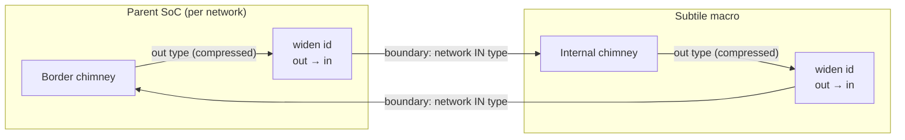

# Ollivander Component Standardization: Isles, Subtiles and Tiles

This is the single contract a hardware component must satisfy to be integrated by the Ollivander SoC Generator. It replaces the three guides that preceded it - `isle_standardization.md`, `subtile_standardization.md` and `tile_standardization.md` - which described three levels of what is largely one contract: 947 lines across three files, nine section titles identical in all three, and ownership of individual rules already scattered between them (the isle guide pointed at the subtile guide for the parameter-verification rule, both pointed at the isle guide for memory preloading, and all three restated the dependency mechanism in full).

**How to read it.** **Part 1 is the contract**, and it applies to every level: read it in full whichever kind of component you are writing. **Parts 2, 3 and 4 state only the particularities** of an Isle, a Subtile and a Custom Tile respectively - what that level adds, what it replaces, and what does not apply to it. A particularity chapter never restates a rule from Part 1, so "not mentioned there" always means "as in Part 1".

That rule is the acceptance criterion for any change to this document: a statement that holds for every level belongs in Part 1 and nowhere else. Restating it per level is how the three previous guides came to disagree without anyone noticing.

**Which one am I writing?** An **Isle** (`*_isle.sv`) is topology-agnostic: standard single-network AXI/RegBus ports, usable in both Crossbar and NoC topologies - in a NoC, Ollivander generates the enclosing Tile for it. A **Subtile** (`*_subtile.sv`) is NoC-native: it may expose physically separate narrow and wide networks (`noc_mode: "dual"`) and therefore cannot be used in a Crossbar topology; Ollivander still generates its Tile wrapper. A **Custom Tile** (`*_tile.sv`) is written by hand and instantiates the FlooNoC router itself, connecting directly to the 2D mesh. Prefer an Isle unless you need what the other two give you.

# Part 1 - The Contract

*Applies to Isles, Subtiles and Custom Tiles alike.*

## 1. Parameter Interface (`parameter` vs `localparam`)
Every Isle MUST expose a standardized set of parameters to define bus geometries and microarchitectural behaviors. Ollivander's parser (`sv_parser.py`) actively scans the module header and treats `parameter` and `localparam` differently:

*   **`parameter` (Configurable):** Use this for values that the IP can adapt to dynamically. Ollivander will override these at instantiation time in the top-level based on the YAML configuration.
*   **`localparam` (Fixed Constraint):** Use this in the module header for values that **cannot** be changed (e.g., a hardware IP that strictly requires a 64-bit data bus). Ollivander will add these to a `fixed_params` list, skip them during parameter assignment in the top-level, and **strictly validate** that the global YAML configuration does not violate them. If a violation occurs, the generator halts with an architectural error.


### 1.1 Expected Bus Geometries
These parameters define the physical width of the AXI lines, and the generator drives each from the geometry of the interconnect the component is attached to.
*   `AxiAddrWidth`, `AxiDataWidth`, `AxiUserWidth`: taken from the `global_bus` declaration (crossbar) or from the network (NoC).
*   `AxiInIdWidth`: Width of the AXI ID for incoming requests (required if `axi_slave` is used). Driven with the interconnect's **slave-side** ID width — in a crossbar that is not a `global_bus` field but a computed value, the manager ID width plus the arbitration bits for the number of managers, so it grows when components are added.
*   `AxiOutIdWidth`: Width of the AXI ID for outgoing requests (required if `axi_master` is used). Driven with the manager-side ID width (`mst_id_width`, or the network's input width in a NoC).


How each declaration is treated depends on whether the wrapper declares it `parameter` or `localparam`, and the distinction is the contract. A **`parameter`** is *driven*: the generator sets it to the geometry of the network the port rides on, so a wrapper around a sizeable IP should expose one and propagate it into the IP — every default it would otherwise fall back to describes the context the wrapper was extracted from, not the SoC it lands in. A **`localparam`** is *verified*: it states a geometry the component cannot depart from, and Ollivander checks it against the bus at generation time. Keep those as literals — the check reads the value as written and cannot resolve `some_pkg::SomeWidth` — and, when the IP defines the same number itself, guard the literal with an elaboration-time `$fatal` against the IP's package, as `cluster_subtile` does, so it stays readable to the generator and cannot drift from the IP.

The verification rule is not plain equality. Address and data widths must match exactly, since no adaptation exists for them: a mismatch there is refused. The ID widths are checked **along the direction of travel**: what the component emits (`*OutIdWidth`) may be narrower than the network's input side — the tile zero-extends it — but never wider, or the network would truncate and distinct transactions would alias; what it accepts (`*InIdWidth`) must cover the network's compressed output side, or responses would be misrouted inside the component.

### 1.2 Clock Domain Crossing (CDC) Widths
Since most Isles reside in independent clock domains, they expose pre-calculated widths for the asynchronous AXI channels. This prevents the generator from having to compute complex SystemVerilog `$clog2` macros in the top-level.
*   `LogDepth`: Log2 depth of the CDC FIFOs.
*   `AsyncAxiInAwWidth`, `AsyncAxiInWWidth`, `AsyncAxiInBWidth`, `AsyncAxiInArWidth`, `AsyncAxiInRWidth`
*   `AsyncAxiOutAwWidth`, `AsyncAxiOutWWidth`, `AsyncAxiOutBWidth`, `AsyncAxiOutArWidth`, `AsyncAxiOutRWidth`


### 1.3 System Microarchitecture
To guarantee system-wide coherence without introducing tight coupling to a specific Host package (e.g., Cheshire's `Cfg` struct), Isles use the `ollivander_soc_pkg` as their default value source for system properties:
*   `AxiMaxReadTxns` / `AxiMaxWriteTxns`: Depth of outstanding transactions.
*   `AxiUserAmoMsb` / `AxiUserAmoLsb`: Bit mapping for Atomic Memory Operation (AMO) reservation IDs within the `user` field.
*   `AxiUserEccErrBit`: Bit mapping for the ECC error flag within the `user` field.
*   `AxiAmoNumCuts`: Number of pipeline registers in the AXI ATOP adapters.


### 1.4 Struct Parameter Types (Strict Type Equivalence)
SystemVerilog enforces strict type equivalence for structs. To avoid compilation errors when instantiating Isles in different SoCs (or when exporting an entire SoC as a Macro IP), Isles should expose their AXI structs as `parameter type` in the module header, rather than hardcoding a specific package.
*   `axi_req_t`: Synchronous AXI request type for slave interfaces.
*   `axi_resp_t`: Synchronous AXI response type for slave interfaces.
*   `axi_master_req_t`: Synchronous AXI request type for master interfaces.
*   `axi_master_resp_t`: Synchronous AXI response type for master interfaces.
*   `axi_aw_chan_t`, `axi_w_chan_t`, `axi_b_chan_t`, `axi_ar_chan_t`, `axi_r_chan_t`: Asynchronous channel types (optional, if the IP supports CDC internally).

Ollivander will automatically inject the local SoC package types (e.g., `my_soc_pkg::soc_axi_req_t`) when instantiating the Isle.

In a **NoC**, the types injected are those of the network the port rides on, chosen per direction: the master pair takes the network's input types, the slave pair its output types (or the joined type, where a Join adapter merges the two networks). Exposing the pairs as `parameter type` is therefore what lets an Isle carry the ID and user widths of whatever network it is placed in, and `AxiOutIdWidth` is set to the network's input width for the same reason.

An Isle that instead types its AXI ports from its own IP package — legitimate for a hand-written wrapper around an IP whose widths are fixed, as the snitch cluster subtile does — keeps them, and the tile adapts around it: the ID is zero-extended to the network width on the way out and truncated back on the response, field-wise, so that only `id` is touched. Nothing is lost either way, but the two cases must not be mixed by hand: whether the port types were injected is what decides which of the two the generator applies.

The package name follows the **top-level module name**, not the bare project name, so it carries the same suffix that `build_mode: "macro"` adds. A project `crux` built standalone produces `crux_soc_pkg`, while the same project built as a macro with `export_type: "isle"` produces `crux_isle_soc_pkg`. This is what allows both builds of a project — and a parent SoC that instantiates one of them — to be compiled into a single simulation library without the two packages colliding under the same name.

### 1.5 Memory Mapping Parameters
For topology-agnostic memory wrappers (e.g., L2 memory wrapper `l2_isle.sv`), the wrapper should expose standard configurable parameters defining its size and base address:
*   `InstanceBaseAddr` (`parameter logic [63:0]` or `longint unsigned`): Base address of the memory mapping range.
*   `InstanceWindowSize` (`parameter int unsigned` or `longint unsigned`): Size of the memory block in bytes.

The base address may equally be declared as the **port** `input logic [63:0] instance_base_addr_i`, which is the preferred form and takes precedence when a header declares both: it keeps repeated isles a single module under hierarchical verilation instead of one child library per instance, and it is the only form that can carry a relocatable `MACRO_BASE_ADDR + offset`. `InstanceWindowSize` has no port form. `l2_isle.sv` is the shipped example of the port form (its four localparams and its `mapping_rules` became `assign`ed wires); `pulp_cluster_isle` keeps the parameter, since its base reaches the IP through the struct parameter `Cfg.ClusterBaseAddr` and from there into four child parameter overrides. Section 1.6 owns the full rule.

These are the **instance identity parameters** (section 1.6 owns the full definition): the generator fills them from the component's `axi_slave` window whenever the header declares them, so the local address decoding and interleaving rules computed within the Isle scale correctly. They replace the historical `L2BaseAddr`/`L2MemSize` pair.

The same mechanism serves compute components that decode part of their own slave region internally:

*   `InstanceBaseAddr` also serves the compute clusters: `pulp_cluster_isle` exposes it (formerly `ClusterBaseAddr`) to align the cluster's internal decode (TCDM, peripherals, external escape) with the region the SoC description maps it at — an internal decode left at the IP default would silently route every external access to the wrong rule.

Like every entry of the standard parameter vocabulary, these are matched **by parameter name, per instance**: each component that exposes the parameter receives the base of its own `axi_slave` mapping, so a design may instantiate any number of such components, each decoding its own region. When a **crossbar-family** SoC is built as a macro (`build_mode: "macro"`), `InstanceBaseAddr` is emitted as `MACRO_BASE_ADDR + <base>`: this family keeps global addresses inside the macro, so the decode relocates with it wherever the parent maps it. The **NoC family** does the opposite — its border adapters rebase incoming traffic to project-local addresses, so its identity values stay local (see Part 3).


### 1.6 Instance Identity
Some IPs decode their **own slave window internally**: the block compares incoming addresses against a base and an extent it was told at instantiation, serves what falls inside (local memory, internal peripherals) and forwards the rest to its master port. The snitch-family cluster is the reference case. When such a block is instantiated as a component **array** (a placement `box` with `size_per_instance`), every instance needs its own base — one shared constant cannot serve sixteen windows, and a wrong base makes every window access miss the internal decode and stall (there is no error response: the transaction re-enters the network and never completes).

A subtile that decodes its own window declares the following pair in its header, and the generator fills it **per instance** at tile instantiation (`rtl_ir_builder.py`):

*   `InstanceBaseAddr` (`parameter longint unsigned`): the base address of THIS instance's slave window. The generator resolves it from `base_addr` and `size_per_instance`, either of which may be a per-instance list (`soc_configuration_guide.md` section 3.1) — so it is `base_addr + index * size_per_instance` only in the scalar case, and in every case it comes from the one resolver rather than being recomputed here. The instance enumeration is the x-major one the FlooGen address map and the auto-control-group bit-selects use, so the three mechanisms can never disagree. In macro builds the value stays **project-local**: the macro's border adapters rebase incoming traffic before any tile sees it.
*   `InstanceWindowSize` (`parameter longint unsigned`): the per-instance window extent (`size_per_instance`, or `size` for a single instance). **May differ between instances of one component**, since `size_per_instance` accepts a list.

**The two are independent halves of the opt-in.** Declaring `InstanceWindowSize` alone is enough to receive it: a component that needs to know how big its window is without caring where it starts is not a corner case but the common one for memories, which decode on the low address bits. `sram_isle` and `spm_isle` are both exactly that, and both size their storage from the window (`MemSize = InstanceWindowSize`, `SpmTileSize = InstanceWindowSize`) — the idiom for "build exactly what you map". A project that pins such a parameter in its own `parameters` block overrides that default and pins ONE depth for every instance, which is worth avoiding: with per-instance windows it produces tiles that map less than they hold, i.e. storage no address can reach.

The declared parameter type travels through the SV parser to the generated tile wrapper: a plain built-in type (`bit`, `int unsigned`, `longint unsigned`, `logic[N:M]`, `string`) is re-declared as written, so 64-bit identity values cross the tile boundary intact; only package-scoped or otherwise exotic types still fall back to value-based inference.

**The base address may be declared as a PORT instead of a parameter, and that is now the preferred form.** A component that writes `input logic [63:0] instance_base_addr_i` in its header receives its window base as a driven value rather than an elaborated one; the generator connects it per instance exactly as it would have filled `InstanceBaseAddr`, and if a header declares both the port wins. There is no port form for `InstanceWindowSize`, which stays a parameter: components derive elaboration-time structures from it - bank counts, preload geometry - and those need a constant. It is therefore the one identity value that DOES specialize a module per distinct value under hierarchical verilation, so a component whose instances differ in depth is verilated once per distinct depth (two, for the alternating L2 of `mesh`) rather than once in total. That is the price of building what you map, and it is bounded by the number of distinct sizes, not by the instance count.

Two reasons to prefer the port, one per flow. Under **hierarchical verilation** a parameter whose value differs per instance makes each instance a distinct module, so sixteen identical tiles become sixteen child libraries to verilate and compile, while a port keeps them one module and one library (see section 5.2.1 of `docs/developer/wip/future_evolution_tasks.md`). In a **macro build** the base becomes `MACRO_BASE_ADDR + offset`, a value the parent knows only at its own instantiation: a port connection can carry that expression, a parameter override computed at generation time cannot without freezing the macro's position.

Inside the block, cast the port back to whatever type the IP wants at the inner instantiation (`cluster_subtile.sv` does `snitch_cluster_pkg::addr_t'(instance_base_addr_i)`). Where the value used to feed a `localparam` that must be elaborated - an address-map struct array, for instance - derive it with an `assign` to a wire and hand it to the IP's port instead: `l2_isle.sv` converts its four localparams and its `mapping_rules` this way. A value that genuinely cannot leave elaboration keeps the parameter form: `pulp_cluster_isle` does, because its base flows into the struct parameter `Cfg.ClusterBaseAddr` and from there into four child parameter overrides, which would mean modifying upstream IP.

This is a **declared opt-in**, by parameter or by port: the generator acts only on what the header declares, and never matches on component types. Memory components travel the same route (section 1.5) — one convention for every self-mapping component, memories and clusters alike. The subtile consumes the parameters internally (e.g. `cluster_subtile.sv` drives the meta-generated wrapper's `cluster_base_addr_i`/`cluster_base_offset_i` ports from them, and ties `hart_base_id_i` to zero — global hart IDs deliberately repeat across the array, see the alias-region rationale in the offload contract and the open question in `docs/developer/wip/future_evolution_tasks.md`); no identity port appears on the subtile interface.

## 2. Supported Interfaces & Port Naming
Isles abstract away the native interfaces of their underlying IPs. Ollivander automatically maps these interfaces during generation if they are declared in the YAML and match the exact naming conventions below.

> **⚠️ STRICT NAMING ENFORCEMENT** The naming conventions defined below are **strictly enforced**. No deviations, custom prefixes, or alternative spellings (e.g., using `spih_` instead of `spi_`, or `bootmode` instead of `boot_mode`) are permitted. The primary purpose of the Isle wrapper is to adapt the inner IP's arbitrary port names to match this exact Ollivander standard. Failure to expose these exact names at the Isle boundary will result in unconnected wires and architectural validation errors.

**Dimensionality (Scalars vs. Arrays) & Direction:** 
*   **Standard Components**: Typically expose flat vectors (a single connection). However, if a component defines multiple interfaces of the same type in the YAML (e.g., `ports: 2` for a dual-port `l2_shared_memory`), its ports MUST be packed into arrays indexed by the port number (e.g., `logic [NumPort-1:0][AsyncAxiInAwWidth-1:0] async_axi_in_aw_data_i`).
*   **Host Component**: Because the Host Isle contains the central routing crossbar, its AXI and RegBus ports are complementary to standard components and *always* exposed as multi-dimensional arrays (e.g., `[AxiNumMst-1:0][Width-1:0]`) to aggregate all system traffic.
*   **Direction**: When a component acts as a slave, the Host acts as a master, and vice versa.


### 2.1 AXI Slave (`axi_slave`)
Depending on the `sync_domain` YAML flag, an Isle can receive AXI requests either synchronously or asynchronously.

**Asynchronous (Default, requires CDC):**
*   `async_axi_in_aw_data_i` (`logic [AsyncAxiInAwWidth-1:0]`): Write address channel data payload.
    *   **Ollivander Handling**: Component -> Connected to `xbar_slv_aw_data`. Host -> Array connected to `xbar_mst_aw_data`.
*   `async_axi_in_aw_wptr_i` (`logic [LogDepth:0]`): Write address channel CDC write pointer.
    *   **Ollivander Handling**: Component -> Connected to `xbar_slv_aw_wptr`. Host -> Array connected to `xbar_mst_aw_wptr`.
*   `async_axi_in_aw_rptr_o` (`logic [LogDepth:0]`): Write address channel CDC read pointer.
    *   **Ollivander Handling**: Component -> Connected to `xbar_slv_aw_rptr`. Host -> Array connected to `xbar_mst_aw_rptr`.
*   `async_axi_in_w_data_i` (`logic [AsyncAxiInWWidth-1:0]`): Write data channel data payload.
    *   **Ollivander Handling**: Component -> Connected to `xbar_slv_w_data`. Host -> Array connected to `xbar_mst_w_data`.
*   `async_axi_in_w_wptr_i` (`logic [LogDepth:0]`): Write data channel CDC write pointer.
    *   **Ollivander Handling**: Component -> Connected to `xbar_slv_w_wptr`. Host -> Array connected to `xbar_mst_w_wptr`.
*   `async_axi_in_w_rptr_o` (`logic [LogDepth:0]`): Write data channel CDC read pointer.
    *   **Ollivander Handling**: Component -> Connected to `xbar_slv_w_rptr`. Host -> Array connected to `xbar_mst_w_rptr`.
*   `async_axi_in_b_data_o` (`logic [AsyncAxiInBWidth-1:0]`): Write response channel data payload.
    *   **Ollivander Handling**: Component -> Connected to `xbar_slv_b_data`. Host -> Array connected to `xbar_mst_b_data`.
*   `async_axi_in_b_wptr_o` (`logic [LogDepth:0]`): Write response channel CDC write pointer.
    *   **Ollivander Handling**: Component -> Connected to `xbar_slv_b_wptr`. Host -> Array connected to `xbar_mst_b_wptr`.
*   `async_axi_in_b_rptr_i` (`logic [LogDepth:0]`): Write response channel CDC read pointer.
    *   **Ollivander Handling**: Component -> Connected to `xbar_slv_b_rptr`. Host -> Array connected to `xbar_mst_b_rptr`.
*   `async_axi_in_ar_data_i` (`logic [AsyncAxiInArWidth-1:0]`): Read address channel data payload.
    *   **Ollivander Handling**: Component -> Connected to `xbar_slv_ar_data`. Host -> Array connected to `xbar_mst_ar_data`.
*   `async_axi_in_ar_wptr_i` (`logic [LogDepth:0]`): Read address channel CDC write pointer.
    *   **Ollivander Handling**: Component -> Connected to `xbar_slv_ar_wptr`. Host -> Array connected to `xbar_mst_ar_wptr`.
*   `async_axi_in_ar_rptr_o` (`logic [LogDepth:0]`): Read address channel CDC read pointer.
    *   **Ollivander Handling**: Component -> Connected to `xbar_slv_ar_rptr`. Host -> Array connected to `xbar_mst_ar_rptr`.
*   `async_axi_in_r_data_o` (`logic [AsyncAxiInRWidth-1:0]`): Read data channel data payload.
    *   **Ollivander Handling**: Component -> Connected to `xbar_slv_r_data`. Host -> Array connected to `xbar_mst_r_data`.
*   `async_axi_in_r_wptr_o` (`logic [LogDepth:0]`): Read data channel CDC write pointer.
    *   **Ollivander Handling**: Component -> Connected to `xbar_slv_r_wptr`. Host -> Array connected to `xbar_mst_r_wptr`.
*   `async_axi_in_r_rptr_i` (`logic [LogDepth:0]`): Read data channel CDC read pointer.
    *   **Ollivander Handling**: Component -> Connected to `xbar_slv_r_rptr`. Host -> Array connected to `xbar_mst_r_rptr`.

**Synchronous:**
*   `axi_req_i` (`axi_req_t`): Synchronous AXI request struct.
    *   **Ollivander Handling**: Component -> Connected to `xbar_sync_slv_req`. Host -> Array connected to `xbar_sync_mst_req`.
*   `axi_resp_o` (`axi_resp_t`): Synchronous AXI response struct.
    *   **Ollivander Handling**: Component -> Connected to `xbar_sync_slv_rsp`. Host -> Array connected to `xbar_sync_mst_rsp`.


### 2.2 AXI Master (`axi_master`)
**Asynchronous:**
*   `async_axi_out_aw_data_o` (`logic [AsyncAxiOutAwWidth-1:0]`): Write address channel data payload.
    *   **Ollivander Handling**: Component -> Connected to `xbar_mst_aw_data`. Host -> Array connected to `xbar_slv_aw_data`.
*   `async_axi_out_aw_wptr_o` (`logic [LogDepth:0]`): Write address channel CDC write pointer.
    *   **Ollivander Handling**: Component -> Connected to `xbar_mst_aw_wptr`. Host -> Array connected to `xbar_slv_aw_wptr`.
*   `async_axi_out_aw_rptr_i` (`logic [LogDepth:0]`): Write address channel CDC read pointer.
    *   **Ollivander Handling**: Component -> Connected to `xbar_mst_aw_rptr`. Host -> Array connected to `xbar_slv_aw_rptr`.
*   `async_axi_out_w_data_o` (`logic [AsyncAxiOutWWidth-1:0]`): Write data channel data payload.
    *   **Ollivander Handling**: Component -> Connected to `xbar_mst_w_data`. Host -> Array connected to `xbar_slv_w_data`.
*   `async_axi_out_w_wptr_o` (`logic [LogDepth:0]`): Write data channel CDC write pointer.
    *   **Ollivander Handling**: Component -> Connected to `xbar_mst_w_wptr`. Host -> Array connected to `xbar_slv_w_wptr`.
*   `async_axi_out_w_rptr_i` (`logic [LogDepth:0]`): Write data channel CDC read pointer.
    *   **Ollivander Handling**: Component -> Connected to `xbar_mst_w_rptr`. Host -> Array connected to `xbar_slv_w_rptr`.
*   `async_axi_out_b_data_i` (`logic [AsyncAxiOutBWidth-1:0]`): Write response channel data payload.
    *   **Ollivander Handling**: Component -> Connected to `xbar_mst_b_data`. Host -> Array connected to `xbar_slv_b_data`.
*   `async_axi_out_b_wptr_i` (`logic [LogDepth:0]`): Write response channel CDC write pointer.
    *   **Ollivander Handling**: Component -> Connected to `xbar_mst_b_wptr`. Host -> Array connected to `xbar_slv_b_wptr`.
*   `async_axi_out_b_rptr_o` (`logic [LogDepth:0]`): Write response channel CDC read pointer.
    *   **Ollivander Handling**: Component -> Connected to `xbar_mst_b_rptr`. Host -> Array connected to `xbar_slv_b_rptr`.
*   `async_axi_out_ar_data_o` (`logic [AsyncAxiOutArWidth-1:0]`): Read address channel data payload.
    *   **Ollivander Handling**: Component -> Connected to `xbar_mst_ar_data`. Host -> Array connected to `xbar_slv_ar_data`.
*   `async_axi_out_ar_wptr_o` (`logic [LogDepth:0]`): Read address channel CDC write pointer.
    *   **Ollivander Handling**: Component -> Connected to `xbar_mst_ar_wptr`. Host -> Array connected to `xbar_slv_ar_wptr`.
*   `async_axi_out_ar_rptr_i` (`logic [LogDepth:0]`): Read address channel CDC read pointer.
    *   **Ollivander Handling**: Component -> Connected to `xbar_mst_ar_rptr`. Host -> Array connected to `xbar_slv_ar_rptr`.
*   `async_axi_out_r_data_i` (`logic [AsyncAxiOutRWidth-1:0]`): Read data channel data payload.
    *   **Ollivander Handling**: Component -> Connected to `xbar_mst_r_data`. Host -> Array connected to `xbar_slv_r_data`.
*   `async_axi_out_r_wptr_i` (`logic [LogDepth:0]`): Read data channel CDC write pointer.
    *   **Ollivander Handling**: Component -> Connected to `xbar_mst_r_wptr`. Host -> Array connected to `xbar_slv_r_wptr`.
*   `async_axi_out_r_rptr_o` (`logic [LogDepth:0]`): Read data channel CDC read pointer.
    *   **Ollivander Handling**: Component -> Connected to `xbar_mst_r_rptr`. Host -> Array connected to `xbar_slv_r_rptr`.

**Synchronous:**
*   `axi_req_o` (`axi_master_req_t`): Synchronous AXI request struct.
    *   **Ollivander Handling**: Component -> Connected to `xbar_sync_mst_req`. Host -> Array connected to `xbar_sync_slv_req`.
*   `axi_resp_i` (`axi_master_resp_t`): Synchronous AXI response struct.
    *   **Ollivander Handling**: Component -> Connected to `xbar_sync_mst_rsp`. Host -> Array connected to `xbar_sync_slv_rsp`.


### 2.3 RegBus Slave (`regbus_slave`)
Standard narrow-bus (32-bit) used for configuration registers.

**Asynchronous (`sync_domain: false`):**
*   `reg_async_slv_req_i` (`logic`): Asynchronous register request valid signal.
    *   **Ollivander Handling**: Component -> Connected to the host's `async_reg_req_out` bus. If marked `external: true` in YAML, exposed at the SoC top-level as `<component_name>_reg_req_i`.
*   `reg_async_slv_ack_o` (`logic`): Asynchronous register request acknowledge.
    *   **Ollivander Handling**: Component -> Connected to the host's `async_reg_ack_in` bus. If marked `external: true` in YAML, exposed at the SoC top-level as `<component_name>_reg_ack_o`.
*   `reg_async_slv_data_i` (`reg_intf_pkg::reg_req_t`): Register request payload (address, data, write flag).
    *   **Ollivander Handling**: Component -> Connected to the host's `async_reg_data_out` bus. If marked `external: true` in YAML, exposed at the SoC top-level as `<component_name>_reg_data_i`.
*   `reg_async_slv_req_o` (`logic`): Asynchronous register response valid signal.
    *   **Ollivander Handling**: Component -> Connected to the host's `async_reg_req_in` bus. If marked `external: true` in YAML, exposed at the SoC top-level as `<component_name>_reg_req_o`.
*   `reg_async_slv_ack_i` (`logic`): Asynchronous register response acknowledge.
    *   **Ollivander Handling**: Component -> Connected to the host's `async_reg_ack_out` bus. If marked `external: true` in YAML, exposed at the SoC top-level as `<component_name>_reg_ack_i`.
*   `reg_async_slv_data_o` (`reg_intf_pkg::reg_rsp_t`): Register response payload (read data, error flag).
    *   **Ollivander Handling**: Component -> Connected to the host's `async_reg_data_in` bus. If marked `external: true` in YAML, exposed at the SoC top-level as `<component_name>_reg_data_o`.

**Synchronous (`sync_domain: true`):**
*   `reg_req_i` (`reg_intf_pkg::reg_req_t`): Synchronous register request struct.
    *   **Ollivander Handling**: Component -> Connected to the corresponding slice of the host's synchronous RegBus master port (`sys_reg_req`).
*   `reg_rsp_o` (`reg_intf_pkg::reg_rsp_t`): Synchronous register response struct.
    *   **Ollivander Handling**: Component -> Connected to the corresponding slice of the host's synchronous RegBus master port (`sys_reg_rsp`).


### 2.4 JTAG (`jtag`)
Standard 4-wire JTAG interface. Output enable (`_oe_o`) is provided for tristate pad integration at the chip level.
*   `jtag_tck_i` (`logic`): JTAG Test Clock.
    *   **Ollivander Handling**: Exposed as a top-level SoC I/O pin. The pin is named `jtag_<component_name>_tck_i` (e.g., `jtag_safety_island_tck_i`). For the host component, the prefix is omitted.
*   `jtag_trst_ni` (`logic`): JTAG Test Reset (active low).
    *   **Ollivander Handling**: Exposed as a top-level SoC I/O pin named `jtag_<component_name>_trst_ni`.
*   `jtag_tms_i` (`logic`): JTAG Test Mode Select.
    *   **Ollivander Handling**: Exposed as a top-level SoC I/O pin named `jtag_<component_name>_tms_i`.
*   `jtag_tdi_i` (`logic`): JTAG Test Data In.
    *   **Ollivander Handling**: Exposed as a top-level SoC I/O pin named `jtag_<component_name>_tdi_i`.
*   `jtag_tdo_o` (`logic`): JTAG Test Data Out.
    *   **Ollivander Handling**: Exposed as a top-level SoC I/O pin named `jtag_<component_name>_tdo_o`.
*   `jtag_tdo_oe_o` (`logic`): JTAG Test Data Out Enable (high when driving TDO). **[OPTIONAL]**
    *   **Ollivander Handling**: Ollivander automatically parses the Isle's SystemVerilog header. If this port is declared in the module, it is wired and exposed at the SoC top-level as `jtag_<component_name>_tdo_oe_o`. If omitted from the wrapper, Ollivander safely ignores it without causing compilation errors.


### 2.5 Serial Link (`slink`)
Source-synchronous DDR off-chip link (pulp-platform `serial_link`). The port names and shapes below are the standard a component must expose for Ollivander to export the interface; the channel and lane geometry comes from `slink_reg_pkg`, the same package both ends of the link read, so the two sides cannot disagree.

*   `slink_rcv_clk_i` (`logic [SlinkNumChan-1:0]`): received forwarded clock, one per channel.
    *   **Ollivander Handling**: Exposed as a top-level SoC I/O pin when `"slink"` appears in the component's `export_interfaces`; without the export the ports are tied off inside the top. Pin names follow the peripheral rule (component-name prefix, omitted for the host).
*   `slink_rcv_clk_o` (`logic [SlinkNumChan-1:0]`): transmitted forwarded clock.
*   `slink_i` (`logic [SlinkNumChan-1:0][SlinkNumLanes-1:0]`): DDR data in.
*   `slink_o` (`logic [SlinkNumChan-1:0][SlinkNumLanes-1:0]`): DDR data out.

**Serial-link preload contract (host components).** A host that supports loading the boot image through the serial link (`testbench.preload_mode: "slink"`, configuration guide section 4.2) declares the contract below in its header, exactly as the JTAG boot contract of section 5.2. The generated testbench instantiates the VIP's off-chip twin from these values, so they must describe the AXI port the DUT-side serial link actually rides; expressions over the component's own header parameters are allowed and survive the isle-to-tile conversion on the NoC family (the tile wrapper re-declares the referenced parameters).

| Localparam | Meaning |
| :--- | :--- |
| `HasSlinkPreload` (`bit`) | `1` declares serial-link preload support. |
| `SlinkAxiAddrWidth` (`int unsigned`) | Address width of the serial link's AXI port. |
| `SlinkAxiDataWidth` (`int unsigned`) | Data width of the same port. |
| `SlinkAxiIdWidth` (`int unsigned`) | Id width of the same port. |
| `SlinkAxiUserWidth` (`int unsigned`) | User width of the same port. |

Generation-time validation: `preload_mode: "slink"` is refused unless the host both declares this contract and lists `"slink"` in `export_interfaces` - without the export the pins never reach the top level and the agent would drive dead wires.

### 2.6 Common Peripherals
All common peripheral ports are exposed as top-level SoC I/O pins. If the component is not the host, the pin names are prefixed with the component's name (e.g., `uart_security_island_tx_o`).

*   **UART (`uart`)**: 
    *   `uart_tx_o` (`logic`): Transmit data.
    *   `uart_rx_i` (`logic`): Receive data.
*   **SPI Host (`spi_host`)**: 
    *   `spi_sck_o` (`logic`): Serial Clock output.
    *   `spi_sck_en_o` (`logic`): Serial Clock output enable.
    *   `spi_csb_o` (`logic [3:0]` or `logic`): Chip Select (active low).
    *   `spi_csb_en_o` (`logic [3:0]` or `logic`): Chip Select output enable.
    *   `spi_sd_o` (`logic [3:0]`): Serial Data output (for Single/Dual/Quad SPI).
    *   `spi_sd_en_o` (`logic [3:0]`): Serial Data output enable. 
    *   `spi_sd_i` (`logic [3:0]`): Serial Data input.
*   **I2C (`i2c`)**: 
    *   `i2c_sda_o` (`logic`): Serial Data output. 
    *   `i2c_sda_i` (`logic`): Serial Data input.
    *   `i2c_sda_en_o` (`logic`): Serial Data output enable (for open-drain pad).
    *   `i2c_scl_o` (`logic`): Serial Clock output.
    *   `i2c_scl_i` (`logic`): Serial Clock input.
    *   `i2c_scl_en_o` (`logic`): Serial Clock output enable (for open-drain pad).
*   **HyperBus PHY (`hyperbus_phy`)**: 
    *   `cs_no` (`logic [1:0]`): Chip Select (active low) for multiple devices.
    *   `ck_o` (`logic`): Differential Clock positive.
    *   `ck_no` (`logic`): Differential Clock negative.
    *   `rwds_o` (`logic`): Read/Write Data Strobe output.
    *   `rwds_i` (`logic`): Read/Write Data Strobe input.
    *   `rwds_oe_o` (`logic`): Read/Write Data Strobe output enable.
    *   `dq_i` (`logic [7:0]`): Data Bus input.
    *   `dq_o` (`logic [7:0]`): Data Bus output.
    *   `dq_oe_o` (`logic`): Data Bus output enable.
    *   `reset_no` (`logic`): Device hardware reset (active low). 
*   **RGMII PHY (`rgmii_phy`)**: 
    *   `phy_rx_clk_i` (`logic`): Receive Clock.
    *   `phy_rxd_i` (`logic [3:0]`): Receive Data nibble.
    *   `phy_rx_ctl_i` (`logic`): Receive Control (RX_DV).
    *   `phy_tx_clk_o` (`logic`): Transmit Clock.
    *   `phy_txd_o` (`logic [3:0]`): Transmit Data nibble.
    *   `phy_tx_ctl_o` (`logic`): Transmit Control (TX_EN).
    *   `phy_resetn_o` (`logic`): PHY Reset (active low).
    *   `phy_mdio_i` (`logic`): Management Data Input/Output (Input).
    *   `phy_mdio_o` (`logic`): Management Data Input/Output (Output).
    *   `phy_mdio_oe` (`logic`): Management Data Input/Output enable.
    *   `phy_mdc_o` (`logic`): Management Data Clock.
*   **CAN Bus (`can_top_apb` sub-component)**: 
    *   `rx_i` (`logic`): CAN receive pin.
    *   `tx_o` (`logic`): CAN transmit pin.
    *   **Ollivander Handling**: Automatically exposed at the SoC top-level when instantiated inside an `apb_subsystem`. The pin names are prefixed with the sub-component name (e.g., `can_bus_rx_i`).


## 3. Interrupt Guidelines (Strictly Level-Triggered)
Ollivander establishes a strict hardware contract for the SoC Top-Level: **All interrupt routing is assumed to be level-triggered.**

If your IP natively generates edge-triggered or pulsed interrupts (like some APB timers), **the Isle wrapper must encapsulate an `edge_propagator`** (or equivalent pulse-to-level logic) and expose a stable, level-triggered signal to the outside world.


## 4. Autonomous System Signals
Ollivander's parser reads the SystemVerilog header of your Isle and automatically wires up specific system/control signals if it finds them. You do not need to specify these in the YAML interfaces list.

### Mandatory Signals
Every Isle must implement these basic clocking and reset signals:
*   **`clk_i`** (`logic`): Main clock input, automatically wired to the clock domain assigned in the YAML.
    *   **Ollivander Handling**: Connected to the output of the corresponding clock domain logic (e.g., `periph_clk`).
*   **`rst_ni`** (`logic`): Main reset input (active low), automatically wired to the reset domain assigned in the YAML.
    *   **Ollivander Handling**: Connected to the output of the corresponding reset generator logic (e.g., `rsts_n[ollivander_soc_pkg::DomainIdx_periph]`). If `reset_domain` is not specified in the YAML, it is automatically inferred from the `clock_domain` (e.g., `periph_clk` implies `periph_rst`).

### Optional Signals
These signals are mapped automatically if their exact name is found in the module declaration (all names listed are actively supported by Ollivander):
*   **`pwr_on_rst_ni`** (`logic`): Power-On Reset (active low) associated with the Isle's assigned clock domain. Used for persistent logic.
    *   **Ollivander Handling**: Connected to the power-on-reset output of the corresponding reset generator (e.g., `pwr_on_rsts_n[DomainIdx_periph]`).

> **The two resets are a contract, and choosing between them is a design decision.**
>
> *   **`pwr_on_rst_ni`** is synchronously released (four stages inside the reset generator) and carries only the power-on reset. Put on it every flop whose release must be **timing-constrained**: anything that would produce a metastable value or an illegal state if it left reset on a different cycle from its neighbours.
> *   **`rst_ni`** additionally carries the **software** reset from the System Controller register, and that path is deliberately **not** synchronised (aligned with the astral/carfield convention on 2026-08-27). The register is written only while the block's clock is gated, so recovery and removal have no meaning on it — and the ASIC flow is expected to declare it a **false path**. See [clocking, reset and CDC requirements](clocking_reset_cdc_requirements.md).
>
> An Isle that declares only `rst_ni` gets both resets folded into one net and is perfectly legal; it simply forgoes the distinction, and every flop inside it inherits the unconstrained release.
*   **`sys_clk_i`** (`logic`): Global system clock (`host_clk`). Useful for IPs that operate in a peripheral clock domain but need a reference to the global system time.
    *   **Ollivander Handling**: Hardwired to the main `host_clk` signal.
*   **`sys_rst_ni`** (`logic`): Global system Power-On Reset (`host_pwr_on_rst_n`, active low).
    *   **Ollivander Handling**: Hardwired to the main `host_pwr_on_rst_n` signal.
*   **`rt_clk_i`** (`logic`): The global Real-Time Clock domain (usually 32.768 kHz), used for always-on timers and CLINTs.
    *   **Ollivander Handling**: Hardwired to the main `rt_clk` signal.
*   **`test_mode_i`** (`logic`): DFT/Scan-chain bypass enable flag.
    *   **Ollivander Handling**: Hardwired to the top-level `test_mode_i` input pin.
*   **`boot_mode_i`** (`logic [1:0]`): The system boot mode strapping pins.
    *   **Ollivander Handling**: Hardwired to the top-level `boot_mode_i` input pins.
*   **`boot_addr_i`** (`logic [31:0]` or `[63:0]`): Boot address override provided by the System Controller registers.
    *   **Ollivander Handling**: Intended to be connected to the `sys_regs_reg2hw.<component_name>_boot_addr.q` register output from the System Controller.
*   **`fetch_en_i`** (`logic`): The core fetch enable signal driven by the System Controller registers (allows the Host to wake up the Isle).
    *   **Ollivander Handling**: Connected to the `sys_regs_reg2hw.<component_name>_fetch_enable.q` (or `_boot_enable.q`) register output.
*   **`axi_isolate_i`** (`logic`): AXI isolation request driven by the System Controller: it fences the Isle's **outbound** AXI traffic, so the network is protected from the block while the block is reset, gated or powered down.
    *   **Ollivander Handling**: Connected to `sys_regs_hwif_out.isolate_ctrl.<component_name>_isolate.value`, indexed by instance when the component expands into several. Declaring the port is **optional**: an Isle that does not expose it still gets isolation when `system_config.isolate` is set — the generated tile then instantiates the `axi_isolate` cells itself, on its outbound master ports. Expose the port only if the Isle wants to own the fence, which is the right choice when it has internal state to quiesce alongside it.
*   **`axi_isolated_o`** (`logic`): AXI isolation acknowledgment returned to the System Controller.
    *   **Ollivander Handling**: Connected to `sys_regs_hwif_in.isolate_status.<component_name>_isolated.next`, one bit per instance. A component exposing `axi_isolate_i` must expose this too.
    *   **The signal means "drained OR in reset", and both halves matter.** It asserts when every isolated channel has reached its isolate state, which makes waiting on it a genuine handshake rather than an echo of the request — but the cells' state registers *reset to* that state, so it also reads asserted throughout reset. Waiting for isolation to be **released** is therefore meaningful; reading an asserted bit as proof that traffic was drained is not.
    *   **Which clock it answers on** follows ownership: an Isle-owned cell runs on the Isle's (gated) clock and cannot move until that clock runs, while a tile-owned cell runs on the always-on network clock. De-isolating *after* enabling the clock is the order that works in both, and the order the generated firmware helpers use.
    *   **A tile-owned cell resets with the network side, not with the block it fences**: it takes the tile's ungated domain reset (`rst_ni`), the same one the chimney uses, and never the gated software reset of the component. Both ends of that AXI path therefore reset together — a cell resetting independently of the chimney it feeds would restart one end while the other held mid-transaction state — and the fence survives the reset of the very block it is isolating, which is what makes "isolate, then reset" a usable sequence.
*   **`debug_req_i`** (`logic [1:0]` or `logic`): External debug request signal driven by the System Controller.
    *   **Ollivander Handling**: Connected to the `sys_regs_reg2hw.<component_name>_debug_req.q` register output (enabled via `debug_req: true` in `system_config`).
*   **`busy_o`** (`logic`): Busy status flag exported to the System Controller.
    *   **Ollivander Handling**: Connected to the `sys_regs_hw2reg.<component_name>_busy.d` register input (enabled via `has_busy_status: true` in `system_config`).
*   **`eoc_o`** (`logic`): End of Computation status flag exported to the System Controller (and optionally mapped as an interrupt).
    *   **Ollivander Handling**: Connected to the `sys_regs_hw2reg.<component_name>_eoc.d` register input (enabled via `has_eoc_status: true` in `system_config`).


## 5. The Host Component

One component of the SoC is declared the `host` in the YAML, and the generator treats it differently from every other: it sizes its buses and interrupt vectors from the connectivity of the whole system, and it reads its simulation boot hooks. What follows applies to a host at any level; how the host is wrapped is a particularity of each level (Parts 2, 3 and 4).

### 5.1 Auto-Calculated Host Parameters
To further simplify the configuration, Ollivander automatically calculates several key architectural and interrupt-related parameters for the Host Isle based on the connectivity defined in the YAML sections. The user **should not** specify these in the `parameters` block of the host, as the generator will override them.

#### Bus Interface Counts (Crossbar/NoC Sizing)
To properly dimension the Host's internal crossbar arrays or NoC injection points, Ollivander aggregates the total number of master and slave interfaces in the system:

*   **`AxiNumMstSync` / `AxiNumMstAsync`**: Calculated by counting the total number of `axi_master` interfaces declared by other components in the system. Ollivander routes them to the synchronous or asynchronous parameter based on the overall topology type (e.g., NoC uses Sync, Crossbar typically uses Async).
*   **`AxiNumSlvSync` / `AxiNumSlvAsync`**: Calculated by summing the number of `ports` requested by all `axi_slave` interfaces across the SoC, segregated by their `sync_domain` YAML flag.
*   **`RegNumSlvSync` / `RegNumSlvAsync`**: Calculated by counting all `regbus_slave` interfaces across the SoC (segregated by their `sync_domain` YAML flag), plus one synchronous slave reserved for the central System Controller.

#### Interrupt Vector Sizing
Ollivander infers the required size of the Host's interrupt aggregators by inspecting the bit indices used in the YAML routing matrix.

*   **`NumIntrsIn`**: Automatically calculated by finding the highest bit index used in the `source` mapping for the Host's main input interrupt (e.g., `manager.intr_ext_i`). This determines the required width of the external interrupt aggregator.

*   **`NumIntrsOut`**: Automatically calculated by scanning all components' interrupt sources. It finds the highest bit index requested from the Host's main output interrupt bus (e.g., `manager.intr_ext_o[...]`) and sizes the bus accordingly.

*   **`NumIrqHarts`**: Automatically calculated by counting the total width of all component interrupts that are sourced from the Host's standard RISC-V hart interrupt outputs (`mtip_ext_o`, `msip_ext_o`, `xeip_ext_o`).

*   **`NumDbgHarts`**: Automatically calculated by counting the total width of all component interrupts sourced from the Host's debug interrupt output (`dbg_ext_req_o`).

This auto-sizing mechanism ensures that the Host's interrupt interface is always correctly dimensioned to match the system's connectivity, removing the burden of manual calculation from the user.

### 5.2 Simulation Boot Contracts (force and jtag)
To support dynamic force-booting in simulation, a Host Isle wrapper (e.g., `cheshire_isle.sv`) can optionally expose standard parameters defining the startup control:
*   `HasForceBoot` (`localparam bit`): Set to `1` if this host supports software force-booting in simulation.
*   `ForceBootPath` (`localparam string`): Hierarchical path from the host wrapper top to the entry point scratch register (e.g., `"i_cheshire_soc.i_regs.field_storage.scratch[0].scratch.value"`).
*   `ForceBootVal` (`localparam string`): Force value template (e.g., `"32'h00000000"`).

**JTAG-boot contract.** A host that supports the architected debug-module boot (`testbench.boot_mode: "jtag"`, configuration guide section 4.1) declares three more localparams. The **slink boot consults this block too**: its handoff writes the same scratch registers, it just never touches the TAP.

| Localparam | Meaning |
| :--- | :--- |
| `HasJtagBoot` (`bit`) | `1` declares the architected preboot loop (scratch-register polling) and the debug-module boot road. |
| `JtagIdCode` (`longint unsigned`) | The IDCODE the TAP must return; the VIP's liveness check compares against it explicitly, because an undriven TDO reads X and X falls open through every implicit comparison. |
| `JtagScratchOffset` (`longint unsigned`) | Offset, inside the host's address window, of the scratch registers the boot handoff writes (entry pointer, argument, go word) and the preboot loop polls. |

These parameters are read by the testbench generator to automatically drive the boot entry sequence. The **uart boot road deliberately has no contract block**: it needs only the `uart` export — the protocol, its opcodes and its baudrate are baked into the host's boot ROM, so there is nothing a wrapper could declare that the ROM does not already own.

### 5.3 External-Master Id-Width Contract

A host whose internal crossbar aggregates several masters prepends the ORIGINATING MASTER's index to every id it drives onto the SoC fabric, so its external id width is `<effective master id width> + clog2(<master count>)` - and the count grows with feature switches (on `cheshire_isle`, enabling `SerialLink` adds the fifth internal master). A fabric sized without knowing that count silently truncates the top index bits, and the responses of the high-index masters come back misrouted: the failure stays invisible exactly until one of those masters speaks — typically at the first serial-link preload, when the boot image reaches the L2 and the write response comes back to the wrong master.

The host therefore declares its master count as a contract localparam, and the generator sizes the interconnect FROM it - the same "fabric follows host" practice astral and gwaihir apply by deriving every downstream width from `Cfg.AxiMstIdWidth + $clog2(AxiIn.num_in)`:

| Localparam | Meaning |
| :--- | :--- |
| `NumAxiInMasters` (`int unsigned`) | The host's COMPLETE AXI master count, as an arithmetic expression over the host's own header parameters (`NumCores + 1 + Dma + SerialLink + Vga + 1 + AxiNumMstAsync + AxiNumMstSync`, mirroring `cheshire_pkg::gen_axi_in` field by field INCLUDING its external-master term - the NoC ingress and a parent's exported masters join the same crossbar and widen the same ids). Counting only the internal masters left a one-bit undercount on the mesh, silent for the usual reason: the masters above the clog2 plateau never spoke. |
| `AxiExtOutIdWidth` (`int unsigned`) | The resulting external id width, `<saturated master id width> + $clog2(NumAxiInMasters)` - declarative documentation of the same value the generator computes. |

**The contract polices itself at elaboration.** The isle body carries an `initial` check that compares `AxiExtOutIdWidth` against `AxiSlvIdWidth` - the width cheshire itself computes from `gen_axi_in` - and `$fatal`s on any mismatch, in both simulators, at zero cost. A cheshire bump that adds a master, or a feature switch the hand-written mirror forgets, stops every build instead of silently reopening the truncation hole.

**Both families size from this single source** (mirroring how astral and gwaihir derive every downstream width from `Cfg.AxiMstIdWidth + $clog2(AxiIn.num_in)`):

- **NoC family**: the generator (`src/core/macro_boundary.py`, `host_ext_out_id_width`) resolves `NumAxiInMasters` numerically - the driven `AxiNumMst*` values land in `host.parameters` before resolution - and imposes `3 + clog2(count)` on every network the host masters, alongside the widths the nested macros impose. The match then closes by construction: the resolved network width flows back into the host's `AxiOutIdWidth`, whose saturation at 3 reproduces the same sum.
- **Crossbar family**: there the SoC "crossbar" IS the host's internal one - external masters enter through the host's ext-mst ports at the declared `global_bus.mst_id_width`, as extra `AxiIn` entries of the same crossbar. `crossbar_slv_id_width` sizes the slave side as `<saturated mst_id_width> + clog2(count)` from the SAME resolved contract (primed once by the generator, `host_axi_in_masters`). The older hand-maintained `crossbar_master_count` remains only as the fallback for hosts that declare no contract; its deliberately-present defaults for optional masters can only err WIDER, which the field-wise boundary assigns absorb safely (ids zero-extend outward, responses truncate back within range).

A host that declares no contract keeps the legacy sizing on both families - a non-cheshire host owes nothing to this rule.

### 5.4 Autonomous-Boot Contract

A host whose bootrom can fetch the firmware from an external memory device by itself (`testbench.boot_mode: "spi_flash"` / `"i2c_eeprom"`, configuration guide section 4.1) declares the contract below in its header. Everything in it is HOST KNOWLEDGE the generator would otherwise have to hardcode: where the bootrom loads the image (its internal scratchpad - the parent map treats the host window as opaque, so only the host can say), which behavioral device models its own dependency graph ships (the generated testbench instantiates the named model; the VIP stays IP-agnostic), which strap value selects each source (the bootrom's own case values), and the exact geometry of the GPT image its ROM scans for (the generated software Makefile renders its `sgdisk`/`dd` recipe FROM these values). `cheshire_isle` declares the full block.

| Localparam | Meaning |
| :--- | :--- |
| `HasAutonomousBoot` (`bit`) | `1` declares the autonomous boot roads. |
| `BootSpmOffset` / `BootSpmSize` (`longint unsigned`) | The internal scratchpad the bootrom loads into, as an offset inside the host's address window plus its size: the generated linker script links the autonomous firmware for this region instead of the project's boot memory. |
| `BootSpiFlashModel` (`string`) | Module name of the behavioral SPI NOR flash model (ships with the host's own Bender graph). |
| `BootSpiFlashFileParam` (`string`) | The model's preload-file PARAMETER name. The image must go through the model's own preload mechanism: the model blank-fills its array from an initial block, and a testbench-side `$readmemh` races that fill at time zero and loses silently. |
| `BootSpiFlashCs` (`int unsigned`) | The chip select the bootrom boots from (the project must build the SPI master with enough chip selects to cover it). |
| `BootModeSpiFlash` (`int unsigned`) | The `boot_mode_i` strap value for the SPI-flash source. |
| `BootI2cEepromModel` (`string`) | Module name of the behavioral I2C EEPROM model. |
| `BootI2cEepromMemPath` (`string`) | The model's memory ARRAY name - the flash's opposite: this model has no native preload and never initializes its array, so the testbench-side fill-and-load is the only way and is race-free there. |
| `BootI2cEepromCount` (`int unsigned`) | How many chips sit on the bus (upstream's fixture fact: two, the index on the `A0` pin, the image preloaded on chip 0). |
| `BootModeI2cEeprom` (`int unsigned`) | The `boot_mode_i` strap value for the I2C-EEPROM source. |
| `BootZslTypeGuid` (`string`) | The partition type GUID the bootrom's GPT scan boots from (`sgdisk` spelling); the software flow stamps it on the firmware partition of the boot image. |
| `BootImgPayloadLba` / `BootImgPadLbas` (`int unsigned`) | Image geometry, bootrom knowledge too: the LBA the firmware partition starts at, and the padding the image is sized with (upstream's own test-image recipe). |

Generation-time validation: the autonomous modes are refused unless the matching interface is exported (`"spi"` / `"i2c"` in `export_interfaces`), and they take NO `preload_mode`/`preload_memories` - the image travels inside the boot device.

## 6. Dependency Management
Ollivander features an automated dependency resolution engine that scans your Isles and populates the `Bender.yml` manifest. This ensures that only the files and IP packages actually instantiated in the SoC are included in the compilation flow.

### 6.1 Static Dependencies (SystemVerilog Files)
For standard `.sv` files, declare dependencies using special comments anywhere in the file (typically at the top):

*   **Bender Packages**: Use `// BENDER: name="<package_name>"` to link an external repository. Ollivander will look up the git URL and version in the `ollivander_config.yml` registry.
    ```systemverilog
    // BENDER: name="axi"
    // BENDER: name="common_cells"
    ```
    You can also override the registry inline (though not recommended for SSoT): `// BENDER: name="my_ip" git="https://..." version="1.0"`

*   **Local Infrastructure Files**: Use `// OLLIVANDER: require="<filename.sv>"` to include a local file from the `components/` directories. Ollivander will automatically locate it and add its relative path to the manifest.
    ```systemverilog
    // OLLIVANDER: require="edge_propagator.sv"
    // OLLIVANDER: require="tc_clk_gating.sv"
    ```

*   **Compilation Macros**: Use `// DEFINE: name="<macro>"` when the IPs this Isle pulls in do not compile without a `+define+`. It is the compile-time counterpart of the `BENDER` pragma: every project that instantiates the Isle inherits the define, without having to know why it is needed, and a project exported as a macro re-exports it to its own consumers, so the define travels across nesting levels together with the RTL that needs it.
    ```systemverilog
    // DEFINE: name="FEATURE_ICACHE_STAT"
    ```
    Defines are merged **by macro name**, and a `defines` entry in the project's own SoC description wins over the pragma, so a project can replace a valued define (`NAME=VAL`) without editing the wrapper. Note that `+define+` applies to the whole compilation library, not just to this Isle's sources.

*   **Hierarchical-Verilation Restriction**: use `// OLLIVANDER: exclude_hier_block="<reason>"` when the Isle's subtree contains a construct Verilator refuses inside a `--lib-create` child library — a delay of any form (statement-position or intra-assignment), or a `fork ... join_none` inside a class declared in a package. The generator then keeps the Isle, **and every tile or isle whose subtree contains it**, out of the hierarchical block set of `cfg/<top>.vlt`, and prints the reason at generation time. The reason is part of the pragma on purpose: Verilator's own refusal message carries no source location, so an exclusion without a written reason looks arbitrary to whoever reads the configuration later. The shipped `hyperbus_isle` carries the reference specimen (its delay-line simulation model uses an intra-assignment delay). A macro export forwards the mark automatically, so a parent project that nests the macro inherits the restriction without knowing its origin.

*   **Hierarchical-Block Declaration**: the positive counterpart, `// OLLIVANDER: hier_block="<module_name>"` (one line per module), names internal modules that **can** be verilated as hierarchical child libraries. An exported macro emits these automatically — they are the lines of the child project's own `cfg/<top>.vlt` — but the pragma is equally available to a hand-written component that wraps a large hierarchy with repeated internal units. The uniform rule the generator applies: a component that declares internal blocks never becomes a block itself (its wrapper is inlined and the declared modules get their own build lanes; blocks nested inside blocks are deliberately not attempted), and whatever the declaration *omits* stays inlined — the consuming project does not guess why a module was left out.

### 6.2 Dynamic Dependencies (Mako Templates)
If your Isle is dynamically generated (a `.sv.mako` file), you should avoid hardcoding dependency comments if the underlying hardware instantiation is conditional (e.g., inside an `% if` block). 

Instead, use the injected Python functions to dynamically register dependencies *only if* the Mako condition is met. These functions will automatically print the correct `// OLLIVANDER:` or `// BENDER:` tag into the generated `.sv` file and register it in the manifest.

```mako
% if use_custom_divider:
  ${require_file("custom_divider.sv")}
  custom_divider i_div ( ... );
% endif

% if enable_axi:
  ${require_bender("axi")}
% endif
```

## 7. Memory Preloading Standardization
For memory Isles that require simulation-only binary preloading (via `$readmemh`), the wrapper can optionally expose standard `localparam` values in its SystemVerilog module declaration. This allows Ollivander to automatically determine how to format and load firmware files without any hardcoded component knowledge.

### 7.1 Parameters Definition
Declare the following localparams inside your memory wrapper's parameter list:

*   **`PreloadType`** (`string`): The preload mode. Supported values:
    *   `"interleaved"`: Indicates the memory contains multiple physical SRAM banks in an interleaved arrangement, requiring a split firmware HEX binary.
    *   If omitted or set to any other value, a standard flat preloading is performed.
*   **`PreloadTemplate`** (`string`): The internal hierarchical path template from the Isle wrapper top to the individual physical SRAM array. It supports bracket formatting variables `{group}` and `{bank}`:
    *   Example: `"i_l2_top.gen_bank_group[{group}].i_dyn_mem_bank_group.genblk1[{bank}].i_ecc_sram_wrap.i_bank.sram"`
*   **`PreloadNumGroups`** (`int unsigned`): The number of bank groups.
*   **`PreloadBankWidth`** (`int unsigned`): The data width of a single physical SRAM bank in bits.
*   **`PreloadBanksPerGroup`** (`int unsigned`): The number of physical SRAM banks in each group (optional, dynamically calculated as `AxiDataWidth / PreloadBankWidth` if omitted or set to 0).
*   **`PreloadInterleave`** (`string`): The physical interleaving scheme of the memory, i.e. what the `{group}` and `{bank}` indices of `PreloadTemplate` actually select. Supported values are `"lane-group"` and `"word-group"`, described in the next section. Defaults to `"word-group"` if omitted, which preserves the behaviour of legacy wrappers.

### 7.2 Interleaving Schemes

**Declaring the wrong scheme is never caught by a tool.** Generation, hex splitting, compilation and elaboration all succeed: the firmware is simply written into the wrong physical locations, and nothing compares it against what the RTL will read back.

The simulation does fail, but late and with a misleading symptom. The CPU boots normally, executes correctly until the end of the first AXI word that happens to land where the RTL expects it, then fetches whatever the mis-split image left behind — typically raising an illegal-instruction exception. Because the host reboots and retries, the log fills with identical exceptions at a fixed PC and the run ends on the testbench timeout with no UART output, which looks far more like a broken boot flow than a corrupted memory image.

If you suspect this failure mode, compare a wide read from the memory against the linked binary: the first `PreloadBankWidth` bits will match and the rest will not. Pick the value that matches how your wrapper is actually wired.

Throughout this section, `W` is the AXI word index of a byte address relative to the base of the memory, `W = rel_addr / (AxiDataWidth / 8)`, and a *lane* is one `PreloadBankWidth`-wide slice of the AXI data word.

#### `"lane-group"` — groups are data lanes

Used by `sram_isle` and `spm_isle`. Every AXI word is spread across **all** groups simultaneously, one lane each, and the `{bank}` index is the depth (row-select) coordinate taken from the high address bits:

*   `{group}` = the lane index, holding bits `[group*PreloadBankWidth +: PreloadBankWidth]` of every AXI word. `PreloadNumGroups` therefore equals `AxiDataWidth / PreloadBankWidth`.
*   `{bank}` = `W / words_per_macro`, where `words_per_macro = (MemSize / (AxiDataWidth/8)) / PreloadBanksPerGroup`.
*   The word address inside the selected SRAM macro is `W % words_per_macro`.

#### `"word-group"` — groups are address-interleaved

Used by `l2_isle`. Consecutive AXI words rotate across the groups, and each AXI word is then sliced lane by lane across consecutive banks *of the selected group*:

*   `{group}` = `W % PreloadNumGroups`.
*   `{bank}` = `d * num_lanes + lane`, where `num_lanes = AxiDataWidth / PreloadBankWidth` and `d` is the depth index derived from `W / PreloadNumGroups`.

### 7.3 Execution Workflow
When Ollivander parses a YAML configuration where `preload_memories` refers to a component wrapper declaring `PreloadType = "interleaved"`, the generator:
1.  **Testbench Generation**: Automatically iterates over `PreloadNumGroups` and `PreloadBanksPerGroup` (falling back to `AxiDataWidth / PreloadBankWidth` if undefined) to generate individual `$readmemh` statements targeted at each physical bank using the resolved hierarchical path from `PreloadTemplate`.
2.  **Hex Splitting Target**: Automatically appends a call to the generic `split_hex.py` script under the Makefile's `build-sw` target, passing the base address, size, and parsed width/group parameters, plus `--interleave <PreloadInterleave>` so the split matches the physical wiring described above.

---

## 8. Offload Boot Contract

An Isle that wraps a **programmable accelerator** (a compute cluster the host can hand work to) can declare an *offload boot contract*: a block of `Offload*` localparams in its module parameter list, following exactly the mechanism the `Preload*` localparams of section 8 use for memories. The contract is the **IP-internal half** of what the generated `offload` test application (see the SoC configuration guide, section 5.1) needs to drive the component; the SoC-side half — which isolation, fetch-enable and EOC status registers exist in the System Controller — is declared by the user in the component's `system_config` and never restated here. The Isle declares only what the YAML cannot know: the register layout behind its own slave window, and the ISA its cores execute.

### 8.1 Parameters Definition

*   **`OffloadContract`** (`string`): The kind of boot protocol the IP implements. Two kinds are supported:
    *   `"control_wire"` — payload and per-core boot addresses are written by the host through the slave window, the cores are released by the SoC-side fetch-enable wire, completion is signalled on `eoc_o` and the result read back from an MMIO register. The pulp-cluster style.
    *   `"memory_mapped"` — the cores park in the IP's own bootrom at reset; the host writes the entry point to a register behind the slave window and wakes the cores through the cluster CLINT, and completion returns through per-core slots in the cluster-local memory (each slot carries `(value << 1) | 1`, done in bit 0, 31 bits of value). The snitch/spatz style; no SoC-side wire is involved at all.

Parameters common to both kinds:

*   **`OffloadCtrlOffs`** (`int unsigned`): Offset of the IP's control unit (control_wire) or peripheral block (memory_mapped) from the component's `axi_slave` base address.
*   **`OffloadReturnOffs`** (`int unsigned`): control_wire: offset of the register the payload leaves its result in. memory_mapped: offset, from the component's base, of the FIRST per-core return slot (one 32-bit slot per core, consecutive).
*   **`OffloadStackOffs`** (`int unsigned`): Top of the IP-local memory the payload may use as its stack, as an offset from the component's base address (memory_mapped payloads carve 512 B per core downward from it).
*   **`OffloadCollectOffs`** / **`OffloadCollectColOffs`** / **`OffloadBarrierOffs`** / **`OffloadCollMetaOffs`** / **`OffloadMcastOffs`** (`int unsigned`, optional, memory_mapped only): offsets, in the IP-local memory above the return slots, of the collective slots. Declaring them makes the component eligible for the collective (narrow-reduction) test when it is the NoC's multicast group. FlooNoC's sequential reduction engine merges at most two contributions per node, so the reduction is dimension-ordered and two-phase: every instance's core 0 adds into its own COLUMN head's `CollectColOffs` slot (the tile's stamper derives each writer's head from its own base), the heads then add the column sums along their row into instance 0's `CollectOffs` slot, and the host verifies that final sum against a generator-derived expectation; the full-group `LsbAnd` barrier lands at `BarrierOffs`. `CollMetaOffs` is plain memory, not a stamped window: the host writes each instance's `{y_dim, is_head}` meta word there before waking it (cluster hartids restart per instance, so the head election must come from the side that knows the geometry; a zero meta parks the whole phase, used in the selective-power pass). Which slots a component declares decides which collectives it is tested with, and they are independent: `BarrierOffs` and `CollMetaOffs` are the minimum (barrier alone), `McastOffs` adds the multicast, and the reduction pair `CollectOffs`+`CollectColOffs` additionally requires the narrow channel to be declared in the SoC description. `McastOffs` is unlike the others in one respect: it is not a single destination but a per-member landing - one member writes into the stamped window, the network replicates the beat, and each member receives it at ITS OWN copy of the offset, which is what the host's per-member check verifies. Three further declarations belong to the wide side. **`OffloadWideOffs`** is the wide collective landing: a full 512-bit beat, so aligned to 64 bytes rather than 8, and written by the cluster's DMA rather than by a core. **`OffloadWideSrcOffs`** is the 64-byte source buffer of the instance's contribution, separate from the landing because on the group's instance 0 the two would otherwise coincide. **`OffloadDmaHart`** names the one hart allowed to execute the DMA instructions (they trap as illegal on every other one) and **`OffloadPrimaryHart`** the core that runs the workload and issues the collectives - both facts about THIS component, declared so that the software templates never hardcode an index that belongs to the IP; the DMA hart is checked at elaboration against the cluster's ISA configuration. **`OffloadWideUserLayout`** (`string`, optional) states what the component's wide AXI user MEANS: `"floo_collective"` says it carries FlooNoC's `{collective_mask, collective_op}` - mask on top - on both its wide ports, which is how the tile knows to type the wide isolation cell and the chimney with the collective types and to rebuild inbound requests into the component's own type. It is a semantic, deliberately not a width: the widths are checked in elaboration on the real ports, and a component that leaves it undeclared must keep its wide user no wider than the network's plain one or generation refuses it. Two placement rules the generator enforces: the destination lives inside the group's own region (a reduction's member mask converts to coordinates only through the SAM rule of its destination), and every WINDOWED slot offset is aligned to the narrow channel's beat - the collective machinery consumes the beat at channel width (`LsbAnd` ANDs data bit 0 of the whole beat, the integer ALU computes on the low word), so a sub-width store at an unaligned offset is silently reduced as garbage.
*   **`OffloadNumCores`** (`int unsigned`): Number of cores the boot loop, the wake mask and the payload's hart demux must cover. May reference another literal parameter of the same header (e.g. `= NumCores`): the generator resolves one hop of indirection.
*   **`OffloadIsa`** / **`OffloadAbi`** (`string`): The `-march` / `-mabi` pair the payload is cross-compiled with. Spell extensions out the way modern binutils want them (`rv32im_zicsr`, not `rv32im`), and keep the ISA conservative: any multilib of the host toolchain must be able to serve it.

`control_wire` only:

*   **`OffloadEocOffs`** (`int unsigned`): Offset, inside the control unit, of the EoC register the payload writes to raise `eoc_o`.
*   **`OffloadBootAddrOffs`** / **`OffloadBootAddrStride`** (`int unsigned`): Offset of the first per-core boot-address register and the distance between consecutive ones.

`memory_mapped` only:

*   **`OffloadEntryOffs`** (`int unsigned`): Offset, inside the peripheral block, of the entry-point register the IP's bootrom jumps through.
*   **`OffloadWakeOffs`** (`int unsigned`): Offset, inside the peripheral block, of the CLINT set register the host writes the wake mask to.
*   **`OffloadHartBase`** (`int unsigned`): First hart id of the cluster (snitch-family harts are numbered globally): the payload derives its core index as `mhartid - OffloadHartBase`.

**Return-code convention (memory_mapped)**: core 0's slot carries the workload checksum; every SECONDARY core returns one distinctive generator-owned code (`offload_secondary_code`, single-sourced into the payload's `-D` set and the host firmware's check), and the host verifies it per-core, exactly. A dead core is caught by the done-bit poll, a wrong-path core by the code check, and the two failures print differently on purpose — gwaihir's exact-accounting practice.

Two rules keep the contract robust, both inherited from hard-won constraints:

*   **Scalars and strings only, never `localparam type`**: a type parameter in a wrapper header evicts the module from hierarchical Verilation (see `docs/getting_started.md`, section 8.3).
*   **Self-contained literals**: every value must be a literal or a one-hop reference to another literal of the same header, because the contract is parsed from the wrapper file alone, without elaborating its package dependencies.

### 8.2 Eligibility and Discovery

The contract alone does not make a component an offload target: the generated firmware also needs the SoC-side half, and what that half is depends on the kind. A `"control_wire"` component's `system_config` must declare at least `fetch_enable: true` and `has_eoc_status: true`; a `"memory_mapped"` component needs neither — its cores wake through the CLINT behind the slave window and report through memory, so the window itself is the whole system-side requirement. Either kind adds `isolate: true` when the domain resets isolated, which shapes the generated bring-up prologue. Discovery is automatic — every component satisfying both halves is tested, unless `test_app.offload_targets` restricts the list. A component that declares a contract but misses its SoC-side half is reported and skipped in auto-discovery, and is a hard error when named explicitly.

### 8.3 Reference Implementation

`pulp_cluster_isle.sv` carries the reference `"control_wire"` contract; the authority for its offsets is the wrapped IP's own control unit (`cluster_control_unit.sv` of `cluster_peripherals`), and the header comment of the block records that derivation. `spatz_cluster_isle.sv` and `cluster_subtile.sv` carry the reference `"memory_mapped"` contracts; their authority is the IP's peripheral register description (`spatz_cluster_peripheral_reg.hjson`) plus the cluster bootrom, and their header comments record both the derivation and the bootrom patching it forced (see `patch_spatz.py` in the dependency registry). When wrapping a new cluster IP, derive the offsets the same way — from the RTL or register description behind the slave window, never from a software header of a reference project.

# Part 2 - Particularities of an Isle

*Only what is specific to an Isle; Part 1 applies unchanged.*

## 9. The Isle
An Isle is the topology-agnostic form, and it is the one to reach for by default: the same wrapper compiles into a Crossbar SoC and, through a generated Tile wrapper, into a NoC one. Everything in Part 1 applies to it unchanged. Three things are specific to this level.

### 9.1 A Single, Unified AXI Network

An Isle supports only **one** AXI network. The bus-geometry parameters of section 1.1 therefore appear once, unprefixed, and the struct types of section 1.4 come as a single pair. An IP that natively drives physically separate narrow and wide networks cannot be an Isle - that is what a Subtile is for (Part 3).

### 9.2 Dedicated LLC Port (`llc_port`)
Certain Hosts (like Cheshire) expose a dedicated asynchronous AXI Master port intended specifically to route high-bandwidth traffic directly to an external memory controller (e.g., HyperBus), bypassing the main system crossbar entirely.

**Host Side (Master):**
*   `async_axi_llc_aw_data_o` (`logic [AsyncAxiLlcAwWidth-1:0]`): Write address channel data payload.
*   `async_axi_llc_aw_wptr_o` (`logic [LogDepth:0]`): Write address channel CDC write pointer.
*   `async_axi_llc_aw_rptr_i` (`logic [LogDepth:0]`): Write address channel CDC read pointer.
*   *(... and all other standard AXI channels following the `async_axi_llc_*` prefix)*
*   `async_axi_llc_isolate_i` / `async_axi_llc_isolated_o`: Dedicated isolation fence for the LLC domain.

**Peripheral Side (Slave):** Components marked with the `llc_port` interface in the YAML (e.g., `hyperbus_isle`) simply expose the standard asynchronous AXI Slave ports (`async_axi_in_*`).
*   **Ollivander Handling**: The generator automatically creates direct point-to-point wires between the Host's `async_axi_llc_*` master ports and the peripheral's `async_axi_in_*` slave ports, creating a private high-speed link.


### 9.3 The Host Isle & Interconnect Requirement

The auto-calculated parameters and the force-boot hooks of section 5 apply to a Host Isle as they do to any host. What follows is specific to hosting a **crossbar** SoC.

#### 9.3.1 The Crossbar Mandate
In a Crossbar-based topology, **the Host Isle MUST internally contain the AXI crossbar** (or the NoC injection points). Ollivander builds the address map and routing arrays in the Python generator and passes them via the `ollivander_soc_pkg`. The Host Isle is responsible for reading these arrays and instantiating the physical crossbar that demultiplexes `axi_ext_slv` traffic and multiplexes `axi_ext_mst` traffic.

#### 9.3.2 Dynamic Configuration Builder Pattern
To maintain a standardized interface while supporting massive Host configurations (like Cheshire's `cheshire_cfg_t` struct), the Host Isle implements the **Dynamic Configuration Builder Pattern**:

1.  **Standard Interface:** It exposes only flat, scalar parameters (`AxiNumMst`, `NumCores`, `FeatureUart`, etc.) and system arrays.
2.  **Internal Builder:** A SystemVerilog `function automatic cheshire_cfg_t build_cheshire_cfg()` is defined locally inside the wrapper.
3.  **Struct Assembly:** The function takes the scalar parameters and the arrays provided by the generator package and translates them into the complex struct required by the inner IP.

This strictly enforces a unidirectional data flow: `YAML Topology -> Python Generator -> ollivander_soc_pkg.sv -> cheshire_isle.sv -> cheshire_soc`


#### 9.3.3 RegBus Master (Host Only)
The Host Isle acts as the central RegBus orchestrator and exposes multi-dimensional arrays to drive all configuration registers in the system.

**Asynchronous:**
*   `reg_async_mst_req_o` (`logic [RegNumSlvAsync-1:0]`): Connected to `async_reg_req_out`.
*   `reg_async_mst_ack_i` (`logic [RegNumSlvAsync-1:0]`): Connected to `async_reg_ack_in`.
*   `reg_async_mst_data_o` (`async_reg_out_req_t [RegNumSlvAsync-1:0]`): Connected to `async_reg_data_out`.
*   `reg_async_mst_req_i` (`logic [RegNumSlvAsync-1:0]`): Connected to `async_reg_req_in`.
*   `reg_async_mst_ack_o` (`logic [RegNumSlvAsync-1:0]`): Connected to `async_reg_ack_out`.
*   `reg_async_mst_data_i` (`async_reg_out_rsp_t [RegNumSlvAsync-1:0]`): Connected to `async_reg_data_in`.

**Synchronous:**
*   `reg_req_o` (`sync_reg_out_req_t [RegNumSlvSync-1:0]`): Connected to `sys_reg_req`.
*   `reg_rsp_i` (`sync_reg_out_rsp_t [RegNumSlvSync-1:0]`): Connected to `sys_reg_rsp`.


# Part 3 - Particularities of a Subtile

*Only what is specific to a Subtile; Part 1 applies unchanged.*

## 10. The Subtile
A Subtile is the NoC-native form: the user provides pure AXI/RegBus interfaces and Ollivander generates the enclosing `*_tile.sv`, instantiating the FlooNoC Router, the Chimneys, the Bus Joins and - for a host - the Central System Controller. It **cannot** be used in a Crossbar topology, and Ollivander rejects it during validation if attempted.

Everything in Part 1 applies unchanged, with these additions. The reason to write a Subtile rather than an Isle is the dual-network case of section 10.1; if your IP speaks a single AXI network, write an Isle and gain the crossbar topology for free.

### 10.1 Dual-Network Mode (`noc_mode`)

The expected naming depends strictly on the **`noc_mode`** and **`sync_domain`** fields of the YAML. In **joined** mode everything is exactly as in Part 1: a single unprefixed set of parameters, types and ports. In **dual** mode the Subtile connects to two independent networks at once and every name carries a network prefix.

Bus geometries (section 1.1), dual mode:
    *   `AxiNarrowDataWidth`, `AxiWideDataWidth`
    *   `AxiNarrowUserWidth`, `AxiWideUserWidth`
    *   `AxiNarrowInIdWidth`, `AxiNarrowOutIdWidth`, `AxiWideInIdWidth`, `AxiWideOutIdWidth`
    *   *(Note: `AxiAddrWidth` is assumed global for the SoC, but `AxiNarrowAddrWidth` is supported).*

Struct types (section 1.4), dual mode:
    *   `axi_narrow_req_t`, `axi_narrow_resp_t`
    *   `axi_wide_req_t`, `axi_wide_resp_t`

Ports (section 2), dual mode:
*   **AXI slave**: `axi_narrow_req_i` / `axi_narrow_resp_o`, `axi_wide_req_i` / `axi_wide_resp_o`
*   **AXI master**: `axi_narrow_req_o` / `axi_narrow_resp_i`, `axi_wide_req_o` / `axi_wide_resp_i`
*   **Asynchronous**: the `async_axi_in_*` and `async_axi_out_*` families of Part 1 gain the same prefixes - `async_axi_narrow_in_*`, `async_axi_wide_in_*`, and likewise for `out`.

### 10.2 Which Type Each Network Pair Carries
In dual mode both pairs carry the **input** type of the network — the slave port and the master port alike. FlooNoC compresses IDs across a network (`InIdWidth` > `OutIdWidth`), so the output of one chimney can never be handed straight to the input of the next one: each side widens its own chimney output back to the input width before exporting it, which keeps the adaptation next to the chimney that narrowed the ID and lets the two boundaries connect directly. The widening is field-wise, so that it applies to `id` alone.



Both arrows crossing the boundary carry the same input-typed struct, which is why the two sides connect directly: every compressed-to-input adaptation stays on the side whose chimney produced the compressed ID.

Typing these ports from the Subtile's own SoC package instead exports a single ID and user width for both networks and both directions, which matches neither of them: since `id` is the first member of the struct, and therefore occupies its most significant bits, the resulting connection does not merely truncate the ID but misaligns every field of the channel.

A wrapper that does **not** expose these as `parameter type`, typing its ports from its own IP package instead, is left connected to the chimney output directly — that is the width a subordinate side expects, and the `snitch_cluster` subtile is the example in the tree.

### 10.3 A Subtile Exported as a Whole Project
A whole project exported with `export_type: "subtile"` is a distinct case from a hand-written wrapper, and one constraint on it comes from outside the project: it plugs its slave ports into the chimneys of the network FlooGen generated for it, so it *accepts* a fixed ID width. Its SoC package publishes that width, a parent reads it back, and a parent network resolving wider is refused rather than truncated at the boundary. The number may therefore have to be declared on the network of the exporting project — see [Network ID width](../soc_configuration_guide.md#22-topology-topology) in the SoC configuration guide, which covers the whole rule and the diagnostics.

### 10.4 The Host Subtile Exception (Hierarchy Flattening)
The Host component (e.g., `cheshire_subtile.sv`) is treated specially by Ollivander to avoid unnecessary hierarchy levels.

When a Subtile is defined as the `host` in the YAML configuration, Ollivander generates a `*_tile.sv` wrapper that does **four** things:

1.  Instantiates the **FlooNoC Router**.
2.  Instantiates the **Chimneys** to convert the Host's AXI traffic to NoC packets.
3.  Instantiates the **Host Subtile** itself.
4.  Instantiates the **System Controller (`_reg_top`)**.

#### 10.4.1 RegBus Orchestration
The Host Subtile must act as the RegBus master for the entire SoC. It should expose multi-dimensional arrays for the RegBus:

*   `reg_req_o` (`sync_reg_out_req_t [RegNumSlvSync-1:0]`)
*   `reg_rsp_i` (`sync_reg_out_rsp_t [RegNumSlvSync-1:0]`)
*   *(And corresponding `reg_async_mst_*` arrays for asynchronous slaves).*

**The Flattening Mechanism:**
Inside the generated Tile wrapper, Ollivander intercepts the **lowest index** of the synchronous RegBus (`reg_req_o[0]`) and routes it directly to the locally instantiated System Controller (`_reg_top`). 
The remaining RegBus array slices (`[RegNumSlvSync-1:1]`) are routed out of the Tile and up to the SoC Top-Level, where they are distributed to the other Subtiles/Tiles in the system.

# Part 4 - Particularities of a Custom Tile

*Only what is specific to a Custom Tile; Part 1 applies unchanged.*

## 11. The Custom Tile
A Custom Tile is a hand-written NoC node: instead of letting Ollivander wrap an IP, the wrapper *itself* instantiates the `floo_nw_router` or connects directly to the 2D mesh. Write one only for the cases that need it:
1.  **Dummy Tiles** (`dummy_tile.sv`): Empty routing nodes used to bridge physical distances in the mesh floorplan.
2.  **Custom Offload Nodes**: Tiles that manipulate custom NoC packets (e.g., multicast or reductions) directly at the router level without going through standard AXI Chimneys.
3.  **Third-Party Pre-Packaged Tiles**: IPs that already include a FlooNoC-compatible router inside their top-level RTL.

Everything in Part 1 applies unchanged - including the interrupt contract, the dependency mechanism, the memory-preloading parameters and the generic port export driven by `export_interfaces`. Four things are specific to this level.

### 11.1 Mandatory NoC Boundary Interfaces
Because a Custom Tile is instantiated directly within the NoC 2D mesh array by the `noc_soc_top.sv.mako` template, it **MUST** expose the exact FlooNoC routing interfaces in all four cardinal directions (`[West:North]`).

The following ports are mandatory and strictly checked by the generator:

```systemverilog
import floo_pkg::*;
// Note: You should also import your project-specific NoC package 
// (e.g., floo_gwaihir_noc_pkg::*) to get the correct struct definitions.

// Narrow Network
output floo_req_t  [West:North] floo_req_o,
input  floo_rsp_t  [West:North] floo_rsp_i,
input  floo_req_t  [West:North] floo_req_i,
output floo_rsp_t  [West:North] floo_rsp_o,

// Wide Network (Required even if internally tied to zero)
output floo_wide_t [West:North] floo_wide_o,
input  floo_wide_t [West:North] floo_wide_i
```

### 11.2 The Tile's Coordinate Identity
*   **`id_i`** (`id_t`): the physical X/Y coordinate assigned to this Tile by the mesh generator, and a mandatory port. The internal router needs it to know its position; nothing else in the contract carries it.

### 11.3 Clock and Reset Control Under an Auto Control Group

A Tile subject to an `auto_control_group` receives its gating controls at the tile boundary, where an Isle would receive the System Controller signals of section 4:
*   **`tile_clk_en_i`** (`logic`): Software-controlled clock enable, active high (`1` = clock enabled). Driven by bit `i` of the group's `<group>_clk_en` register, where `i` is the instance index of this Tile within the group.
*   **`tile_rst_ni`** (`logic`): Software-controlled reset, **active low** at the pin. It is driven by the *inverse* of bit `i` of the group's `<group>_rst` register, which is active high (`1` = held in reset); the inversion happens in the SoC top-level.
*   **`clk_rst_bypass_i`** (`logic`): Hardware override to bypass clock gating and software resets during test modes. It is also the escape hatch that allows a Tile to be used before any CSR has been written.

The power-on value of both registers is set by `system_controller.power_on_state`, which defaults to `"gated"`: the Tile comes up with its clock disabled and its reset asserted, and must be brought up explicitly. See the [System Controller section](../soc_configuration_guide.md#25-system-controller-system_controller) of the SoC configuration guide.

Gating a Tile must never break traffic that merely routes *through* it. Keep the NoC router (and, preferably, the chimney) on the ungated `clk_i` / `rst_ni`, and confine `tile_clk` and `tile_rst_n` to the payload IP.

### 11.4 NoC Struct Parameter Types
Because Custom Tiles natively interact with the NoC router, the quickest integration method is to hardcode the import of the local NoC package (e.g., `import floo_gwaihir_noc_pkg::*;`) inside the wrapper to access the `floo_req_t` and `id_t` structs.

However, if you are designing a **truly reusable** Custom Tile meant to be instantiated across different SoCs (or exported within different Macros), hardcoding the package will cause strict type equivalence errors during compilation. To make the Custom Tile fully portable, you should expose the NoC structs as `parameter type` in the module header:
*   `floo_req_t`, `floo_rsp_t`, `floo_wide_t`
*   `id_t`
*   `sam_rule_t` (if handling address mapping directly)

*(Note: Because Ollivander currently auto-injects AXI types but not NoC types into Custom Tiles, you must explicitly map these NoC types in the `parameters` block of your YAML configuration if you choose to parameterize them).*

*Note: Because Custom Tiles natively instantiate the NoC router, they must often rely on the auto-generated NoC configuration package (e.g., `AxiCfgN`, `AxiCfgW`, `RouteCfg`) provided by FlooGen, rather than relying solely on scalar parameters.*
