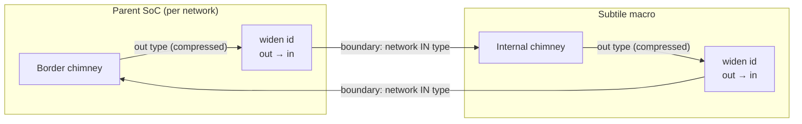

# Ollivander Unified Component Model: The "Subtile" Standardization

## 1. Overview
In the Ollivander SoC Generator configured for a Network-on-Chip (NoC) topology, hardware components (memories, peripherals, and hosts) can be provided by the user in two ways:

1.  **Custom Tiles (`*_tile.sv`)**: Highly coupled components where the user manually instantiates the FlooNoC router to manipulate custom NoC packets (e.g., multicast or reductions).
2.  **Subtiles (`*_subtile.sv`)**: Standardized IP wrappers. The user provides pure AXI/RegBus interfaces. Ollivander automatically generates the enclosing `*_tile.sv` wrapper, instantiating the FlooNoC Router, Chimneys, Bus Joins, and (if applicable) the Central System Controller.

**Cross-Topology Reusability (`_isle` vs `_subtile`)**:
To maximize IP reuse, Ollivander establishes a strict hierarchical naming convention:
*   **`*_isle.sv` (Topology-Agnostic)**: Uses standard single-network AXI/RegBus ports. Can be instantiated safely in both Crossbar and NoC topologies. In a NoC, Ollivander automatically generates a Tile wrapper for it.
*   **`*_subtile.sv` (NoC-Specific)**: Designed natively for NoC topologies (e.g., uses `noc_mode: "dual"` to expose physically separate narrow and wide AXI networks). **Cannot** be used in a Crossbar topology. Ollivander will reject it during validation if attempted.

This document provides the definitive guide for hardware designers creating **Subtiles**.

---

## 2. Parameter Interface (`parameter` vs `localparam`)
Every Subtile MUST expose a standardized set of parameters to define bus geometries and microarchitectural behaviors. 
Ollivander's parser (`sv_parser.py`) actively scans the module header:

*   **`parameter` (Configurable):** Ollivander will dynamically override these at instantiation time in the generated Tile wrapper based on the YAML configuration.
*   **`localparam` (Fixed Constraint):** Hardcoded IP constraints (e.g., a memory that strictly requires a 64-bit data bus). Ollivander will strictly validate that the global YAML configuration does not violate them.

### 2.1 Expected Bus Geometries
These parameters define the physical width of the AXI lines. 
If the Subtile connects to multiple independent NoC networks simultaneously (e.g., `noc_mode: "dual"` in YAML), the parameters MUST be prefixed with `AxiNarrow...` or `AxiWide...`.

*   **Standard / Joined Mode:**
    *   `AxiAddrWidth`, `AxiDataWidth`, `AxiUserWidth`
    *   `AxiInIdWidth` / `AxiOutIdWidth`
*   **Dual Mode (Dual-Network Subtiles):**
    *   `AxiNarrowDataWidth`, `AxiWideDataWidth`
    *   `AxiNarrowUserWidth`, `AxiWideUserWidth`
    *   `AxiNarrowInIdWidth`, `AxiNarrowOutIdWidth`, `AxiWideInIdWidth`, `AxiWideOutIdWidth`
    *   *(Note: `AxiAddrWidth` is assumed global for the SoC, but `AxiNarrowAddrWidth` is supported).*

How each declaration is treated depends on whether the wrapper declares it `parameter` or `localparam`, and the distinction is the contract. A **`parameter`** is *driven*: the generator sets it to the geometry of the network the port rides on, so a wrapper around a sizeable IP should expose one and propagate it into the IP — every default it would otherwise fall back to describes the context the wrapper was extracted from, not the SoC it lands in. A **`localparam`** is *verified*: it states a geometry the component cannot depart from, and Ollivander checks it against the bus at generation time. Keep those as literals — the check reads the value as written and cannot resolve `some_pkg::SomeWidth` — and, when the IP defines the same number itself, guard the literal with an elaboration-time `$fatal` against the IP's package, as `cluster_subtile` does, so it stays readable to the generator and cannot drift from the IP.

The verification rule is not plain equality. Address and data widths must match exactly, since no adaptation exists for them: a mismatch there is refused. The ID widths are checked **along the direction of travel**: what the component emits (`*OutIdWidth`) may be narrower than the network's input side — the tile zero-extends it — but never wider, or the network would truncate and distinct transactions would alias; what it accepts (`*InIdWidth`) must cover the network's compressed output side, or responses would be misrouted inside the component.

A whole project exported with `export_type: "subtile"` is a distinct case from a hand-written wrapper, and one constraint on it comes from outside the project: it plugs its slave ports into the chimneys of the network FlooGen generated for it, so it *accepts* a fixed ID width. Its SoC package publishes that width, a parent reads it back, and a parent network resolving wider is refused rather than truncated at the boundary. The number may therefore have to be declared on the network of the exporting project — see [Network ID width](../soc_configuration_guide.md#22-topology-topology) in the SoC configuration guide, which covers the whole rule and the diagnostics.

### 2.2 Clock Domain Crossing (CDC) Widths
Since most Subtiles reside in independent clock domains, they expose pre-calculated widths for the asynchronous AXI channels to avoid complex `$clog2` macros in the top-level.
*   `LogDepth`: Log2 depth of the CDC FIFOs.
*   `AsyncAxiInAwWidth`, `AsyncAxiInWWidth`, `AsyncAxiInBWidth`, `AsyncAxiInArWidth`, `AsyncAxiInRWidth`
*   `AsyncAxiOutAwWidth`, `AsyncAxiOutWWidth`, `AsyncAxiOutBWidth`, `AsyncAxiOutArWidth`, `AsyncAxiOutRWidth`

### 2.3 System Microarchitecture
To guarantee system-wide coherence without tight coupling to a specific system package, Subtiles use the dynamic project package (e.g., `gwaihir_soc_pkg`) as their default value source for system properties:
*   `AxiMaxReadTxns` / `AxiMaxWriteTxns`: Depth of outstanding transactions.
*   `AxiUserAmoMsb` / `AxiUserAmoLsb`: Bit mapping for Atomic Memory Operation (AMO) reservation IDs.
*   `AxiUserEccErrBit`: Bit mapping for the ECC error flag within the `user` field.

### 2.4 AXI Struct Parameter Types (Strict Type Equivalence)
To avoid strict type equivalence errors, Subtiles should expose their AXI structs as `parameter type` in the module header.
*   **Standard / Joined Mode:**
    *   `axi_req_t`, `axi_resp_t`
*   **Dual Mode:**
    *   `axi_narrow_req_t`, `axi_narrow_resp_t`
    *   `axi_wide_req_t`, `axi_wide_resp_t`

Ollivander will automatically inject the appropriate network types from the local NoC package when instantiating the Subtile.

In dual mode both pairs carry the **input** type of the network — the slave port and the master port alike. FlooNoC compresses IDs across a network (`InIdWidth` > `OutIdWidth`), so the output of one chimney can never be handed straight to the input of the next one: each side widens its own chimney output back to the input width before exporting it, which keeps the adaptation next to the chimney that narrowed the ID and lets the two boundaries connect directly. The widening is field-wise, so that it applies to `id` alone.



Both arrows crossing the boundary carry the same input-typed struct, which is why the two sides connect directly: every compressed-to-input adaptation stays on the side whose chimney produced the compressed ID.

Typing these ports from the Subtile's own SoC package instead exports a single ID and user width for both networks and both directions, which matches neither of them: since `id` is the first member of the struct, and therefore occupies its most significant bits, the resulting connection does not merely truncate the ID but misaligns every field of the channel.

A wrapper that does **not** expose these as `parameter type`, typing its ports from its own IP package instead, is left connected to the chimney output directly — that is the width a subordinate side expects, and the `snitch_cluster` subtile is the example in the tree.

### 2.5 Memory Mapping Parameters
For memory subtiles (e.g., `l2_subtile.sv`), the wrapper should expose standard configurable parameters defining its size and base address:
*   `L2BaseAddr` (`parameter logic [63:0]`): Base address of the memory mapping range. Defaults to a standard constant (e.g., `64'h88000000`).
*   `L2MemSize` (`parameter int unsigned`): Size of the memory block in bytes. Defaults to a standard constant (e.g., `32'h00200000` / 2 MB).

These parameters are dynamically overridden at instantiation time by the generator based on the YAML configuration interfaces mapping.

### 2.6 Instance Identity Parameters

Some IPs decode their **own slave window internally**: the block compares incoming addresses against a base and an extent it was told at instantiation, serves what falls inside (local memory, internal peripherals) and forwards the rest to its master port. The snitch-family cluster is the reference case. When such a block is instantiated as a component **array** (a placement `box` with `size_per_instance`), every instance needs its own base — one shared constant cannot serve sixteen windows, and a wrong base makes every window access miss the internal decode and stall (there is no error response: the transaction re-enters the network and never completes).

A subtile that decodes its own window declares the following pair in its header, and the generator fills it **per instance** at tile instantiation (`rtl_ir_builder.py`):

*   `InstanceBaseAddr` (`parameter longint unsigned`): the base address of THIS instance's slave window. The generator computes `base_addr + index * size_per_instance`, with the same x-major instance enumeration the FlooGen address map and the auto-control-group bit-selects use, so the three mechanisms can never disagree. In macro builds the value stays **project-local**: the macro's border adapters rebase incoming traffic before any tile sees it.
*   `InstanceWindowSize` (`parameter longint unsigned`): the per-instance window extent (`size_per_instance`, or `size` for a single instance).

Current generator bound: the tile wrapper re-declares header parameters with a type inferred from the parsed default value, which normalizes to a 32-bit `int unsigned` — identity values must therefore stay below 4 GiB for now. Every example map satisfies this by construction; lifting the bound means carrying the declared parameter type through the SV parser (noted with the instance-identity follow-ups in `docs/developer/wip/future_evolution_tasks.md`).

This is a **declared-parameter opt-in**, the same route as `L2BaseAddr`/`L2MemSize` above: the generator acts only when the header declares the parameter, and never matches on component types or port names. The subtile consumes the parameters internally (e.g. `cluster_subtile.sv` drives the meta-generated wrapper's `cluster_base_addr_i`/`cluster_base_offset_i` ports from them, and ties `hart_base_id_i` to zero — global hart IDs deliberately repeat across the array, see the alias-region rationale in the offload contract and the open question in `docs/developer/wip/future_evolution_tasks.md`); no identity port appears on the subtile interface.

---

## 3. Supported Interfaces & Port Naming
Subtiles abstract away the native interfaces of their underlying IPs. Ollivander automatically maps these interfaces during Tile generation if they match the exact naming conventions below.
The expected naming convention depends strictly on the **`noc_mode`** and **`sync_domain`** fields defined in the YAML configuration.

> **⚠️ STRICT NAMING ENFORCEMENT**
> The naming conventions defined below are **strictly enforced**. No deviations, custom prefixes, or alternative spellings (e.g., using `spih_` instead of `spi_`, or `bootmode` instead of `boot_mode`) are permitted. 
> The primary purpose of the Subtile wrapper is to adapt the inner IP's arbitrary port names to match this exact Ollivander standard. Failure to expose these exact names at the Subtile boundary will result in unconnected wires and architectural validation errors.

### 3.1 AXI Slave (`axi_slave` in YAML)
Subtiles receiving requests from the NoC.

**A) Default or Joined Mode (`noc_mode: "joined"`, Synchronous):**
Used when the IP connects to a single network, or when Ollivander is instructed to instantiate a Hardware Join to merge multiple networks into one.
*   **`axi_req_i`** (`axi_pkg::axi_req_t` or equivalent struct)
*   **`axi_resp_o`** (`axi_pkg::axi_resp_t` or equivalent struct)

**B) Dual Mode (`noc_mode: "dual"`, Synchronous):**
Used for "Smart" IPs (like compute clusters) that natively handle multiple networks. Ollivander directly connects these to the NoC Chimney.
*   **`axi_narrow_req_i`** / **`axi_narrow_resp_o`**
*   **`axi_wide_req_i`** / **`axi_wide_resp_o`**

**C) Asynchronous Mode (`sync_domain: false`):**
Used when the IP resides in a different clock domain. Ollivander instantiates CDC (Clock Domain Crossing) FIFOs.
*   **`async_axi_in_aw_data_i`** (`logic [AsyncAxiInAwWidth-1:0]`)
*   **`async_axi_in_aw_wptr_i`** (`logic [LogDepth:0]`)
*   **`async_axi_in_aw_rptr_o`** (`logic [LogDepth:0]`)
*   *(... applies to w, b, ar, r channels. If `noc_mode: "dual"`, prefix with `async_axi_narrow_in_...` and `async_axi_wide_in_...`)*

### 3.2 AXI Master (`axi_master` in YAML)
Subtiles sending requests into the NoC (e.g., DMA engines).

**A) Default or Joined Mode (Synchronous):**
*   **`axi_req_o`**
*   **`axi_resp_i`**

**B) Dual Mode (Synchronous):**
*   **`axi_narrow_req_o`** / **`axi_narrow_resp_i`**
*   **`axi_wide_req_o`** / **`axi_wide_resp_i`**

**C) Asynchronous Mode:**
*   **`async_axi_out_aw_data_o`**
*   **`async_axi_out_aw_wptr_o`**
*   **`async_axi_out_aw_rptr_i`**
*   *(... applies to all channels)*

### 3.3 RegBus Slave (`regbus_slave`)
Standard narrow-bus (32-bit) used for configuration registers.

**Asynchronous:**
*   `reg_async_slv_req_i`, `reg_async_slv_ack_o`, `reg_async_slv_data_i`
*   `reg_async_slv_req_o`, `reg_async_slv_ack_i`, `reg_async_slv_data_o`

**Synchronous:**
*   `reg_req_i` (`reg_intf_pkg::reg_req_t`)
*   `reg_rsp_o` (`reg_intf_pkg::reg_rsp_t`)

### 3.4 Common Peripherals (Exported to SoC Top-Level)
All peripheral ports are passed through the generated Tile and exposed as top-level SoC I/O pins.
*   **JTAG**: `jtag_tck_i`, `jtag_trst_ni`, `jtag_tms_i`, `jtag_tdi_i`, `jtag_tdo_o`, `jtag_tdo_oe_o`
*   **UART**: `uart_tx_o`, `uart_rx_i`
*   **SPI Host**: `spi_sck_o`, `spi_sck_en_o`, `spi_csb_o`, `spi_csb_en_o`, `spi_sd_o`, `spi_sd_en_o`, `spi_sd_i`
*   **I2C**: `i2c_sda_o`, `i2c_sda_i`, `i2c_sda_en_o`, `i2c_scl_o`, `i2c_scl_i`, `i2c_scl_en_o`

---

## 4. Autonomous System Signals
Ollivander automatically wires up specific system/control signals if it finds them in your Subtile's header. You do not need to specify these in the YAML `interfaces` list.

### Mandatory Signals
*   **`clk_i`** (`logic`): Main clock input, wired to the clock domain assigned in the YAML.
*   **`rst_ni`** (`logic`): Main reset input (active low), wired to the reset domain assigned in the YAML.

### Optional Signals
*   **`pwr_on_rst_ni`** (`logic`): Power-On Reset (active low).
*   **`sys_clk_i`** / **`sys_rst_ni`**: Global system clock and reset (`host_clk`).
*   **`rt_clk_i`**: Real-Time Clock domain (usually 32.768 kHz).
*   **`test_mode_i`**: DFT/Scan-chain bypass enable flag.
*   **`boot_mode_i`**: System boot mode strapping pins.

---

## 5. The Host Subtile Exception (Hierarchy Flattening)

The Host component (e.g., `cheshire_subtile.sv`) is treated specially by Ollivander to avoid unnecessary hierarchy levels.

When a Subtile is defined as the `host` in the YAML configuration, Ollivander generates a `*_tile.sv` wrapper that does **four** things:

1.  Instantiates the **FlooNoC Router**.
2.  Instantiates the **Chimneys** to convert the Host's AXI traffic to NoC packets.
3.  Instantiates the **Host Subtile** itself.
4.  Instantiates the **System Controller (`_reg_top`)**.

### 5.1 RegBus Orchestration
The Host Subtile must act as the RegBus master for the entire SoC. It should expose multi-dimensional arrays for the RegBus:

*   `reg_req_o` (`sync_reg_out_req_t [RegNumSlvSync-1:0]`)
*   `reg_rsp_i` (`sync_reg_out_rsp_t [RegNumSlvSync-1:0]`)
*   *(And corresponding `reg_async_mst_*` arrays for asynchronous slaves).*

**The Flattening Mechanism:**
Inside the generated Tile wrapper, Ollivander intercepts the **lowest index** of the synchronous RegBus (`reg_req_o[0]`) and routes it directly to the locally instantiated System Controller (`_reg_top`). 
The remaining RegBus array slices (`[RegNumSlvSync-1:1]`) are routed out of the Tile and up to the SoC Top-Level, where they are distributed to the other Subtiles/Tiles in the system.

### 5.2 Auto-Calculated Host Parameters
Ollivander automatically calculates and injects the following parameters into the Host Subtile. The user should not define them in the YAML `parameters` block:

*   **`AxiNumMstSync` / `AxiNumMstAsync`**: Number of external AXI masters injecting traffic into the Host.
*   **`AxiNumSlvSync` / `AxiNumSlvAsync`**: Number of external AXI slaves receiving traffic from the Host.
*   **`RegNumSlvSync` / `RegNumSlvAsync`**: Total number of RegBus slaves in the system (including the System Controller).
*   **`NumIntrsIn` / `NumIntrsOut` / `NumIrqHarts` / `NumDbgHarts`**: Sizes for the interrupt vectors based on the YAML routing matrix.

### 5.3 Simulation Force-Boot Parameters
To support dynamic force-booting in simulation, a Host Subtile wrapper (e.g., `cheshire_subtile.sv`) can optionally expose standard parameters defining the startup control:
*   `HasForceBoot` (`localparam bit`): Set to `1` if this host supports software force-booting in simulation.
*   `ForceBootPath` (`localparam string`): Hierarchical path from the host wrapper top to the entry point scratch register.
*   `ForceBootVal` (`localparam string`): Force value template.

These parameters are read by the testbench generator to automatically drive the boot entry sequence.

---

## 6. Dependency Management

Ollivander features an automated dependency resolution engine that scans your Subtiles (and their generated Tile wrappers) to populate the `Bender.yml` manifest. This ensures that only the files and IP packages actually instantiated in the SoC are included in the compilation flow.

### 6.1 Static Dependencies (SystemVerilog Files)
For standard `.sv` files, declare dependencies using special comments anywhere in the file (typically at the top):

*   **Bender Packages**: Use `// BENDER: name="<package_name>"` to link an external repository. Ollivander will look up the git URL and version in the `ollivander_config.yml` registry.
    ```systemverilog
    // BENDER: name="axi"
    // BENDER: name="floo_noc"
    ```

*   **Local Infrastructure Files**: Use `// OLLIVANDER: require="<filename.sv>"` to include a local file from the `components/` directories. Ollivander will automatically locate it and add its relative path to the manifest.
    ```systemverilog
    // OLLIVANDER: require="tc_clk_gating.sv"
    ```

### 6.2 Dynamic Dependencies (Mako Templates)
If your Subtile is dynamically generated (a `.sv.mako` file), avoid hardcoding dependency comments if the underlying hardware instantiation is conditional.

Instead, use the injected Python functions to dynamically register dependencies *only if* the Mako condition is met. These functions will automatically print the correct `// OLLIVANDER:` or `// BENDER:` tag into the generated `.sv` file and register it in the manifest.

```mako
% if has_clk_ctrl:
  ${require_file("tc_clk_gating.sv")}
  tc_clk_gating i_tc_clk_gating ( ... );
% endif

% if enable_axi:
  ${require_bender("axi")}
% endif
```

---

## 7. Memory Preloading Standardization

For memory Subtiles that require simulation-only binary preloading (via `$readmemh`), the wrapper can optionally expose standard `localparam` values in its SystemVerilog module declaration. This follows the exact same specification as defined in the [Isle standardization guide](isle_standardization.md#8-memory-preloading-standardization):

*   **`PreloadType`** (`string`): Set to `"interleaved"` for interleaved multi-bank preloading.
*   **`PreloadTemplate`** (`string`): The internal hierarchical path template from the Subtile top to the physical SRAM array (supporting `{group}` and `{bank}` variables).
*   **`PreloadNumGroups`** (`int unsigned`): The number of bank groups.
*   **`PreloadBankWidth`** (`int unsigned`): The data width of a single physical SRAM bank in bits.
*   **`PreloadBanksPerGroup`** (`int unsigned`): The number of physical SRAM banks in each group (optional, dynamically calculated as `AxiDataWidth / PreloadBankWidth` if omitted or set to 0).
*   **`PreloadInterleave`** (`string`): The physical interleaving scheme, `"lane-group"` or `"word-group"` (default). Declaring the wrong value silently places the firmware in the wrong physical locations; see the [Interleaving Schemes section](isle_standardization.md#82-interleaving-schemes) of the Isle standardization guide for the exact address mapping of each scheme.
